# SOFTWARE DESIGN SPECIFICATION

## Online Shoe Shopping System

Hanoi, Apr 2026

## Table of Contents

Record of Changes  
I. Software Design Document  
1. High Level Design  
1.1 Software Architecture  
1.2 Package Diagram  
1.2.1 Class Diagram  
1.3 Database Design  
1.4 State Transition Diagrams  
2. Detailed Design  
2.1 Authentication & Account Module  
2.2 Shopping Cart & Checkout Module  
2.3 Order & Shipping Module  
2.4 Product & Inventory Module  
2.5 Administration & Reporting Module  
3. PlantUML Appendix

## Record of Changes

| Date | A/M/D | In charge | Change Description |
|---|---|---|---|
| Apr 25, 2026 | A | Codex | Created initial SDS for Online Shoe Shopping System based on provided SDS template and current project implementation. |
| Apr 25, 2026 | A | Codex | Added PlantUML source blocks for architecture, package, ERD, sequence, activity, and state diagrams. |

`A - Added, M - Modified, D - Deleted`

## I. Software Design Document

## 1. High Level Design

### 1.1 Software Architecture

The current system is implemented as a server-rendered Java web application using `Jakarta Servlet`, `JSP/JSTL`, `JDBC`, `SQL Server`, and `VNPay` for online payment integration. The architecture follows a classic web application structure where browser requests enter the presentation layer, controllers coordinate processing, DAO classes communicate with the database, model classes carry business data, and common utility classes provide shared support logic.

Architecture components:

- `Web Browser`: sends HTTP requests and receives rendered responses.
- `Presentation (Servlet / Controller)`: receives requests, validates inputs, coordinates business flow, and forwards results to views.
- `View (JSP / JSTL)`: renders UI screens and response content for the browser.
- `Data Access (DAO / JDBC)`: executes SQL queries and database updates through JDBC.
- `Model Classes`: represent business data such as account, store, product, order, shipping, voucher, feedback, and related entities.
- `Common Classes`: shared utilities, helpers, session logic, validation logic, and security filters.
- `SQL Server`: persistent data storage for the whole application.
- `VNPay Payment Gateway`: external system for processing secure online payments.

Request-response behavior:

1. Web Browser sends an HTTP request to the Presentation layer.
2. Presentation layer uses Common Classes for validation, security, and helper logic.
3. Presentation layer interacts with Data Access for database operations.
4. Data Access reads or writes SQL Server and maps data into Model Classes.
5. Presentation layer forwards data to View for rendering.
6. View returns the rendered HTTP response to Web Browser.

Current design characteristics:

- The application is monolithic and server-rendered.
- Security and shared behavior are centralized in utility/helper classes and filters.
- DAO classes isolate SQL and JDBC logic from the servlet/controller layer.
- Model classes are used as data carriers between DAO, controller, and view layers.
- SQL Server is the main source of truth for transactional and management data.

#### PlantUML: Context Diagram

The following diagram illustrates the boundaries of the Online Shoe Store System and its interactions with external entities, including financial tracking and staff management.

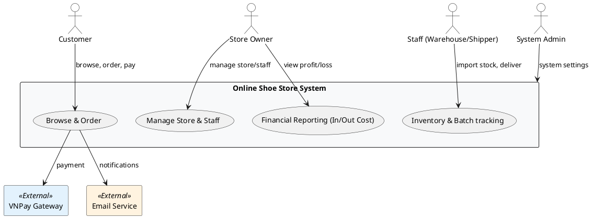


### 1.2 Package Diagram

The codebase is organized mainly by technical layer rather than strict feature package split.

Package descriptions:

| No | Package | Description |
|---|---|---|
| 1 | `controller` | Contains servlet controllers for authentication, storefront, cart, checkout, orders, shipping, admin, and inventory flows. |
| 2 | `dal` | Contains DAO classes for database access such as `AcountDAO`, `ProductDAO`, `OrderDAO`, `ShippingDAO`, `StockImportDAO`, and others. |
| 3 | `model` | Contains domain objects such as `Account`, `Store`, `Product`, `Cart`, `Order`, `OrderDetail`, `Shipping`, `Voucher`, `Feedback`. |
| 4 | `util` | Contains utility classes such as `RoleHelper`, `ValidationUtil`, `PasswordUtil`, `CartService`, `SendMail`, `PasswordResetUtil`. |
| 5 | `vnpay` | Contains VNPay-related configuration and utilities for secure online payment integration. |
| 6 | `web` | Contains JSP pages, shared components, CSS, JavaScript, and deployment descriptors. |

#### PlantUML: Architecture Diagram

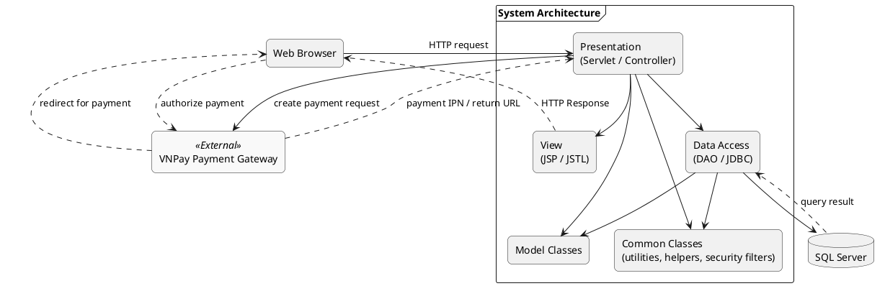

#### PlantUML: Package Diagram

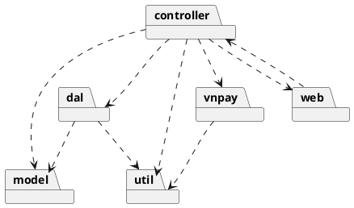

#### 1.2.1 Class Diagram

The following class diagram summarizes the main structural relationships among controllers, DAO classes, model classes, and utility classes used in the implementation.

#### PlantUML: Application Class Diagram

```plantuml
@startuml
skinparam classAttributeIconSize 0
skinparam shadowing false

package controller {
  class BaseRequiredAuthenController
  class LoginController
  class SignupController
  class ProfileController
  class AddToCartController
  class CartController
  class CheckOutController
  class OrderController
  class ShippingController
  class StockImportController
  class ManagerNewsController
  class ManagerContactController
  class ManagerStaffController
  class VoucherController
  class ManagerAccountController
  class ManageStoreController
  class Statistic
  class VnpayPayController
  class VnpayReturnController
}

package dal {
  class DBContext
  class AcountDAO
  class ProductDAO
  class OrderDAO
  class OrderDetailDAO
  class ShippingDAO
  class StockImportDAO
  class VoucherDAO
  class StoreDAO
  class ContactDAO
  class NewsDAO
  class StatisticDAO
  class StaffActionHistoryDAO
}

package vnpay {
  class VnPayConfig
}

package model {
  class Account
  class Store
  class Product
  class Cart
  class Order
  class OrderDetail
  class Shipping
  class Voucher
  class Contact
  class News
  class StockImport
  class StaffActionHistory
}

package util {
  class RoleHelper
  class ValidationUtil
  class PasswordUtil
  class PasswordResetUtil
  class CartService
  class SendMail
}

BaseRequiredAuthenController <|-- AddToCartController
BaseRequiredAuthenController <|-- CartController

LoginController ..> AcountDAO
LoginController ..> StoreDAO
LoginController ..> CartService
LoginController ..> ValidationUtil

SignupController ..> AcountDAO
SignupController ..> ValidationUtil
SignupController ..> SendMail
SignupController ..> PasswordUtil

ProfileController ..> AcountDAO
ProfileController ..> ValidationUtil

AddToCartController ..> ProductDAO
AddToCartController ..> CartService
AddToCartController ..> RoleHelper
AddToCartController ..> ValidationUtil

CartController ..> CartService
CheckOutController ..> CartService
CheckOutController ..> VoucherDAO
CheckOutController ..> ShippingDAO
CheckOutController ..> OrderDAO
CheckOutController ..> OrderDetailDAO
CheckOutController ..> RoleHelper
CheckOutController ..> ValidationUtil

OrderController ..> OrderDAO
OrderController ..> ShippingDAO
OrderController ..> StoreDAO
OrderController ..> AcountDAO
OrderController ..> RoleHelper
OrderController ..> ValidationUtil

ShippingController ..> ShippingDAO
ShippingController ..> OrderDAO
ShippingController ..> StoreDAO
ShippingController ..> RoleHelper

StockImportController ..> StockImportDAO
StockImportController ..> ProductDAO
StockImportController ..> StoreDAO
StockImportController ..> ValidationUtil
StockImportController ..> RoleHelper

ManagerNewsController ..> NewsDAO
ManagerNewsController ..> StoreDAO
ManagerNewsController ..> RoleHelper

ManagerContactController ..> ContactDAO
ManagerContactController ..> StoreDAO
ManagerContactController ..> RoleHelper

ManagerStaffController ..> AcountDAO
ManagerStaffController ..> StoreDAO
ManagerStaffController ..> StaffActionHistoryDAO
ManagerStaffController ..> RoleHelper

VoucherController ..> VoucherDAO
VoucherController ..> StoreDAO
VoucherController ..> RoleHelper

ManagerAccountController ..> AcountDAO
ManageStoreController ..> StoreDAO
Statistic ..> StatisticDAO

VnpayPayController ..> VnPayConfig
VnpayPayController ..> CartService
VnpayReturnController ..> VnPayConfig
VnpayReturnController ..> OrderDAO
VnpayReturnController ..> OrderDetailDAO
VnpayReturnController ..> ShippingDAO
VnpayReturnController ..> VoucherDAO
VnpayReturnController ..> CartService
VnpayReturnController ..> CheckOutController

AcountDAO --|> DBContext
ProductDAO --|> DBContext
OrderDAO --|> DBContext
OrderDetailDAO --|> DBContext
ShippingDAO --|> DBContext
StockImportDAO --|> DBContext
VoucherDAO --|> DBContext
StoreDAO --|> DBContext
ContactDAO --|> DBContext
NewsDAO --|> DBContext
StatisticDAO --|> DBContext
StaffActionHistoryDAO --|> DBContext

AcountDAO ..> Account
StoreDAO ..> Store
ProductDAO ..> Product
OrderDAO ..> Order
OrderDetailDAO ..> OrderDetail
ShippingDAO ..> Shipping
VoucherDAO ..> Voucher
ContactDAO ..> Contact
NewsDAO ..> News
StockImportDAO ..> StockImport
StaffActionHistoryDAO ..> StaffActionHistory

CartService ..> Cart
Cart ..> Product
Order ..> Shipping
OrderDetail ..> Order
Store ..> Account
@enduml
```

### 1.3 Database Design

The application uses SQL Server with plain JDBC. The current implementation confirms these major tables and relationships.

#### 1.3.1 Role

Stores system roles used by authorization.

| No | Field | PK | FK | UN | NN | Description |
|---|---|---|---|---|---|---|
| 01 | `role_key` | X |  | X | X | Role identifier such as `admin`, `owner`, `shipper`, `warehouse_manager`, `customer`. |
| 02 | `role_name` |  |  |  | X | Display name of the role. |
| 03 | `description` |  |  |  |  | Role description. |

#### 1.3.2 Account

Stores customer and staff accounts.

| No | Field | PK | FK | UN | NN | Description |
|---|---|---|---|---|---|---|
| 01 | `uID` | X |  | X | X | Account identifier. |
| 02 | `user` |  |  | X | X | Username for login. |
| 03 | `pass` |  |  |  | X | Password hash/string used by login logic. |
| 04 | `isAdmin` |  |  |  | X | Compatibility/admin flag. |
| 05 | `role` |  | X |  | X | Role key linked to `Role.role_key`. |
| 06 | `active` |  |  |  | X | Active status of the account. |
| 07 | `fullname` |  |  |  |  | Full name. |
| 08 | `phone` |  |  |  |  | Phone number. |
| 09 | `email` |  |  |  |  | Email address. |
| 10 | `address` |  |  |  |  | Address string. |
| 11 | `token` |  |  |  |  | Activation or reset token. |

#### 1.3.3 Store

Stores one shoe store.

| No | Field | PK | FK | UN | NN | Description |
|---|---|---|---|---|---|---|
| 01 | `store_id` | X |  | X | X | Store identifier. |
| 02 | `store_name` |  |  |  | X | Store name. |
| 03 | `owner_id` |  | X | X | X | Account acting as store owner. |
| 04 | `active` |  |  |  | X | Store active flag. |

#### 1.3.4 StoreStaff

Stores staff assignments to specific stores (3NF).

| No | Field | PK | FK | UN | NN | Description |
|---|---|---|---|---|---|---|
| 01 | `store_id` | X | X |  | X | Store reference. |
| 02 | `account_id` | X | X |  | X | Staff account reference. |
| 03 | `staff_role` |  |  |  | X | Staff role such as `shipper` or `warehouse_manager`. |

#### 1.3.5 Manufacturer

Stores product manufacturers/brands.

| No | Field | PK | FK | UN | NN | Description |
|---|---|---|---|---|---|---|
| 01 | `id` | X |  | X | X | Manufacturer identifier. |
| 02 | `name` |  |  |  | X | Brand name. |
| 03 | `country` |  |  |  |  | Origin country. |

#### 1.3.6 Category

Stores product categories.

| No | Field | PK | FK | UN | NN | Description |
|---|---|---|---|---|---|---|
| 01 | `cid` | X |  | X | X | Category identifier. |
| 02 | `cname` |  |  |  | X | Category name. |
| 03 | `store_id` |  | X |  |  | Store scope if category is store-specific. |

#### 1.3.7 Product

Stores general shoe product information.

| No | Field | PK | FK | UN | NN | Description |
|---|---|---|---|---|---|---|
| 01 | `id` | X |  | X | X | Product identifier. |
| 02 | `name` |  |  |  | X | Product name. |
| 03 | `description` |  |  |  |  | Product description. |
| 04 | `cateID` |  | X |  |  | Category reference. |
| 05 | `store_id` |  | X |  |  | Owning store. |
| 06 | `manufacturer_id` |  | X |  |  | Manufacturer reference. |

#### 1.3.8 Color

Stores variant colors.

| No | Field | PK | FK | UN | NN | Description |
|---|---|---|---|---|---|---|
| 01 | `id` | X |  | X | X | Color identifier. |
| 02 | `color_name` |  |  |  | X | Display name of color. |
| 03 | `color_code` |  |  |  |  | Hex code. |

#### 1.3.9 ProductVariant

Stores specific variants (size, color) of a product. (3NF Normalization)

| No | Field | PK | FK | UN | NN | Description |
|---|---|---|---|---|---|---|
| 01 | `id` | X |  | X | X | Variant identifier. |
| 02 | `product_id` |  | X |  | X | Parent product reference. |
| 03 | `color_id` |  | X |  |  | Color reference. |
| 04 | `size` |  |  |  |  | Variant size (e.g., 42, 45). |
| 05 | `sku` |  |  |  |  | Stock Keeping Unit code. |
| 06 | `price` |  |  |  | X | Selling price for this variant. |
| 07 | `quantity` |  |  |  | X | Current available stock. |
| 08 | `image` |  |  |  |  | Variant-specific image. |
| 09 | `status` |  |  |  |  | Variant status. |

#### 1.3.10 Cart

Stores reserved cart rows.

| No | Field | PK | FK | UN | NN | Description |
|---|---|---|---|---|---|---|
| 01 | `AccountID` | X | X |  | X | Customer account id. |
| 02 | `VariantID` | X | X |  | X | Product variant id. |
| 03 | `Amount` |  |  |  |  | Reserved quantity. |
| 04 | `reserved_at` |  |  |  |  | Reservation start time. |
| 05 | `expires_at` |  |  |  |  | Reservation expiry time. |

#### 1.3.11 Shipping

Stores receiver and delivery information.

| No | Field | PK | FK | UN | NN | Description |
|---|---|---|---|---|---|---|
| 01 | `id` | X |  | X | X | Shipping identifier. |
| 02 | `name` |  |  |  |  | Receiver name. |
| 03 | `phone` |  |  |  |  | Receiver phone. |
| 04 | `address` |  |  |  |  | Receiver address. |
| 05 | `Status` |  |  |  |  | Shipping status such as `Pending`, `Delivering`, `Shipped`. |
| 06 | `shipper_id` |  | X |  |  | Assigned shipper. |
| 07 | `store_id` |  | X |  |  | Shipping store. |
| 08 | `shipped_date` |  |  |  |  | Delivery completion date. |

#### 1.3.12 StockImport

Stores stock import history and purchase costs (In Cost).

| No | Field | PK | FK | UN | NN | Description |
|---|---|---|---|---|---|---|
| 01 | `id` | X |  | X | X | Stock import id. |
| 02 | `variant_id` |  | X |  | X | Imported product variant id. |
| 03 | `store_id` |  | X |  | X | Store id. |
| 04 | `import_quantity` |  |  |  | X | Imported quantity. |
| 05 | `unit_cost` |  |  |  | X | Cost price per unit (In Cost). |
| 06 | `batch_number` |  |  |  |  | Batch/Lot number for tracking. |
| 07 | `note` |  |  |  |  | Import note. |
| 08 | `created_at` |  |  |  | X | Creation timestamp. |
| 09 | `created_by` |  | X |  |  | Account id performing the import. |

#### 1.3.13 Orders

Stores order header data.

| No | Field | PK | FK | UN | NN | Description |
|---|---|---|---|---|---|---|
| 01 | `id` | X |  | X | X | Order identifier. |
| 02 | `account_id` |  | X |  |  | Customer account id. |
| 03 | `totalPrice` |  |  |  |  | Final order price. |
| 04 | `note` |  |  |  |  | Order note. |
| 05 | `create_date` |  |  |  |  | Order creation date. |
| 06 | `shipping_id` |  | X |  |  | Linked shipping record. |
| 07 | `store_id` |  | X |  |  | Store receiving the order. |
| 08 | `vat_percent` |  |  |  |  | VAT percent. |

#### 1.3.14 OrderDetail

Stores order line item snapshots.

| No | Field | PK | FK | UN | NN | Description |
|---|---|---|---|---|---|---|
| 01 | `id` | X |  | X | X | Order detail identifier. |
| 02 | `order_id` |  | X |  |  | Parent order id. |
| 03 | `variant_id` |  | X |  |  | Reference to product variant. |
| 04 | `productPrice` |  |  |  |  | Product price snapshot. |
| 05 | `quantity` |  |  |  |  | Purchased quantity. |

#### 1.3.15 HomeSetting

Stores configurable homepage content.

| No | Field | PK | FK | UN | NN | Description |
|---|---|---|---|---|---|---|
| 01 | `id` | X |  | X | X | Home setting identifier. |
| 02 | `hero_badge` |  |  |  |  | Hero badge text. |
| 03 | `hero_title` |  |  |  | X | Hero title. |
| 04 | `hero_highlight` |  |  |  |  | Hero highlight keyword. |
| 05 | `hero_description` |  |  |  | X | Hero description. |
| 06 | `primary_button_text` |  |  |  | X | Primary button text. |
| 07 | `secondary_button_text` |  |  |  |  | Secondary button text. |
| 08 | `featured_title` |  |  |  | X | Featured section title. |
| 09 | `show_stats` |  |  |  | X | Toggle stats. |
| 10 | `show_filter_sidebar` |  |  |  | X | Toggle sidebar. |
| 11 | `show_featured_section` |  |  |  | X | Toggle featured section. |
| 12 | `featured_mode` |  |  |  | X | Featured mode. |
| 13 | `featured_product_id` |  | X |  |  | Featured product reference. |

#### 1.3.16 Slider

Stores homepage slider items.

| No | Field | PK | FK | UN | NN | Description |
|---|---|---|---|---|---|---|
| 01 | `id` | X |  | X | X | Slider identifier. |
| 02 | `title` |  |  |  | X | Slider title. |
| 03 | `image_url` |  |  |  | X | Slider image URL. |
| 04 | `product_id` |  | X |  |  | Product reference. |
| 05 | `status` |  |  |  | X | Active flag. |
| 06 | `description` |  |  |  |  | Slider description. |

#### 1.3.17 Voucher

Stores promotion rules.

| No | Field | PK | FK | UN | NN | Description |
|---|---|---|---|---|---|---|
| 01 | `id` | X |  | X | X | Voucher id. |
| 02 | `code` |  |  | X | X | Voucher code. |
| 03 | `discount_percent` |  |  |  | X | Discount percentage. |
| 04 | `max_discount` |  |  |  |  | Max discount amount. |
| 05 | `min_order_value` |  |  |  |  | Minimum order value to apply voucher. |
| 06 | `expiry_date` |  |  |  | X | Voucher expiry date. |
| 07 | `start_date` |  |  |  | X | Voucher start date. |
| 08 | `store_id` |  | X |  | X | Store that owns the voucher. |

#### 1.3.18 Feedback

Stores customer feedback for products.

| No | Field | PK | FK | UN | NN | Description |
|---|---|---|---|---|---|---|
| 01 | `id` | X |  | X | X | Feedback identifier. |
| 02 | `account_id` |  | X |  | X | Customer account id. |
| 03 | `product_id` |  | X |  | X | Product id. |
| 04 | `store_id` |  | X |  | X | Store id. |
| 05 | `rating` |  |  |  | X | Rating score. |
| 06 | `content` |  |  |  |  | Review content. |
| 07 | `create_date` |  |  |  |  | Created timestamp. |
| 08 | `is_edited` |  |  |  | X | Edited flag. |
| 09 | `is_hidden` |  |  |  | X | Hidden flag. |

#### 1.3.19 News

Stores news posts.

| No | Field | PK | FK | UN | NN | Description |
|---|---|---|---|---|---|---|
| 01 | `id` | X |  | X | X | News identifier. |
| 02 | `title` |  |  |  | X | News title. |
| 03 | `content` |  |  |  | X | News content body. |
| 04 | `image` |  |  |  |  | News image URL. |
| 05 | `created_at` |  |  |  |  | Created timestamp. |
| 06 | `store_id` |  | X |  |  | Nullable store reference. |
| 07 | `is_visible` |  |  |  | X | Visibility flag. |

#### 1.3.20 Contact

Stores customer support tickets.

| No | Field | PK | FK | UN | NN | Description |
|---|---|---|---|---|---|---|
| 01 | `id` | X |  | X | X | Contact ticket identifier. |
| 02 | `account_id` |  | X |  | X | Customer account id. |
| 03 | `order_id` |  | X |  | X | Referenced order id. |
| 04 | `store_id` |  | X |  | X | Related store id. |
| 05 | `message` |  |  |  | X | Support message. |
| 06 | `response_message` |  |  |  |  | Response content. |
| 07 | `responded_at` |  |  |  |  | Response timestamp. |
| 08 | `created_at` |  |  |  |  | Ticket creation timestamp. |
| 09 | `status` |  |  |  |  | Ticket status. |

#### 1.3.21 StaffActionHistory

Stores owner actions on staff.

| No | Field | PK | FK | UN | NN | Description |
|---|---|---|---|---|---|---|
| 01 | `id` | X |  | X | X | History identifier. |
| 02 | `owner_id` |  | X |  | X | Owner performing the action. |
| 03 | `staff_id` |  | X |  | X | Staff account affected. |
| 04 | `action_type` |  |  |  | X | Action type (ADD/UPDATE). |
| 05 | `details` |  |  |  |  | Action details. |
| 06 | `action_at` |  |  |  |  | Action timestamp. |


#### PlantUML: ERD Overview

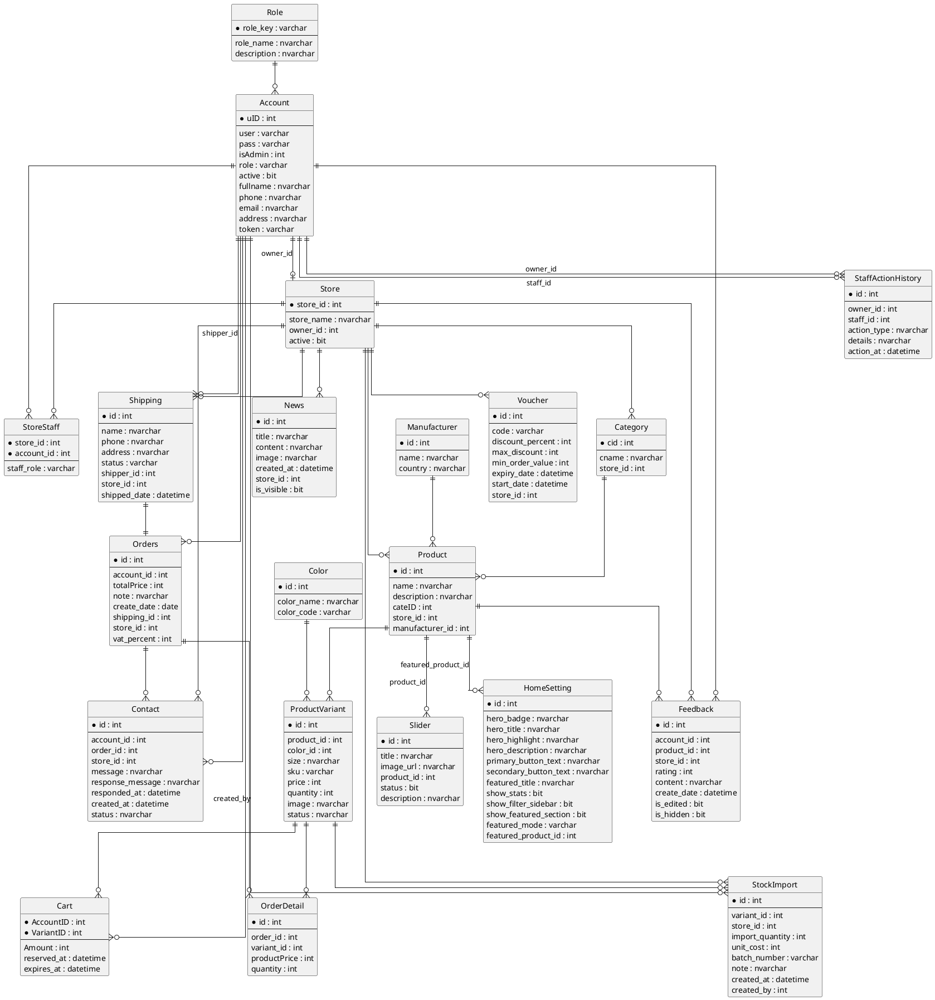
```

### 1.4 Cost Analysis (In Cost - Out Cost)

The system tracks financial performance through the relationship between stock acquisition (In Cost) and sales revenue (Out Cost).

- **In Cost (Expenses)**: Tracked via the `StockImport` table. Every time the Warehouse Manager imports stock for a `ProductVariant`, the `unit_cost` and `import_quantity` are recorded. Total In Cost for a period = `SUM(import_quantity * unit_cost)`.
- **Out Cost (Revenue)**: Tracked via the `Orders` and `OrderDetail` tables. Revenue is the `totalPrice` from completed orders. Profitability is analyzed by subtracting the calculated cost of goods sold (COGS) from the total revenue.
- **Batch Tracking**: Each import is assigned a `batch_number` to allow tracking of cost fluctuations over time and inventory age analysis.


### 1.4 State Transition Diagrams

#### 1.4.1 Shipping Status

Shipping records in the current implementation move through a simple lifecycle.

- Initial state: `Pending`
- After shipper starts delivery: `Delivering`
- After successful completion: `Shipped`

#### PlantUML: Shipping State Diagram

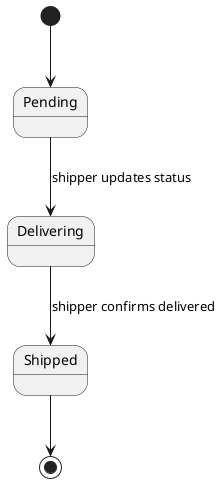

#### 1.4.2 Account Activation / Password Reset State

Account state transitions for authentication flows.

#### PlantUML: Account State Diagram

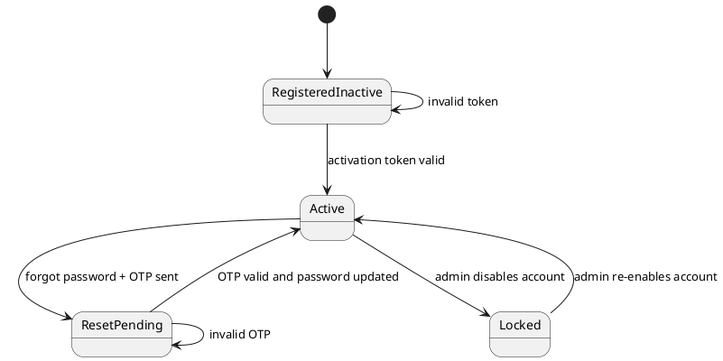

## 2. Detailed Design

### 2.1 Authentication & Account Module

Main classes involved:

- `LoginController`
- `SignupController`
- `ActivateAccountController`
- `SendOtpController`
- `VerifyOtpController`
- `ResetPasswordController`
- `ProfileController`
- `AcountDAO`
- `ValidationUtil`
- `PasswordUtil`
- `RoleHelper`

Design summary:

- `LoginController` validates credentials through `AcountDAO`, checks active status, loads role/store session context, and optionally writes `userC` cookie.
- `SignupController` validates username/email/password and creates inactive customer accounts.
- `ActivateAccountController` activates user through token-based flow.
- Password reset is split into OTP sending, OTP verification, and new password update.
- `ProfileController` loads and updates account profile information.

#### PlantUML: Authentication Class Diagram

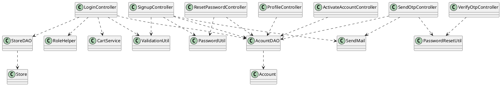

#### PlantUML: Login Sequence Diagram

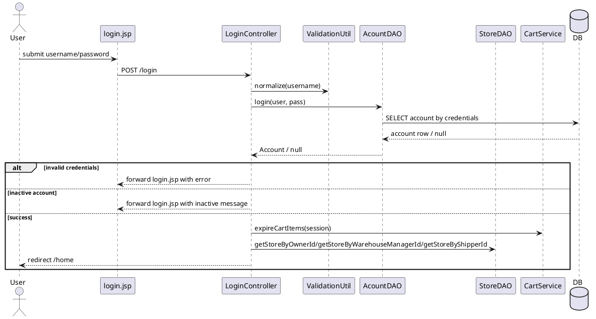

### 2.2 Shopping Cart & Checkout Module

Main classes involved:

- `AddToCartController`
- `CartController`
- `UpdateCartQuantityController`
- `DeleteCartController`
- `ExpireCartController`
- `CheckOutController`
- `CartService`
- `ProductDAO`
- `VoucherDAO`
- `ShippingDAO`
- `OrderDAO`
- `OrderDetailDAO`

Design summary:

- Cart management is customer-only.
- `CartService` is responsible for accessing session cart map and expiring old reserved items.
- `CheckOutController` groups cart lines by store using `splitCartByStore`.
- For each store group, shipping and order header are created separately, then order details are saved from cart snapshots.
- Discount logic supports auto-gift discount and voucher discount, choosing the better discount per store.

#### PlantUML: Cart & Checkout Class Diagram

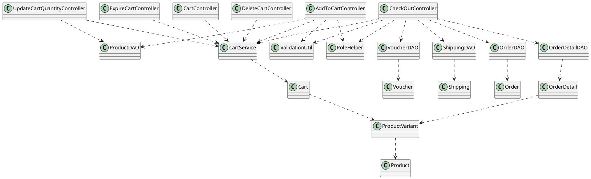

#### PlantUML: Checkout Activity Diagram

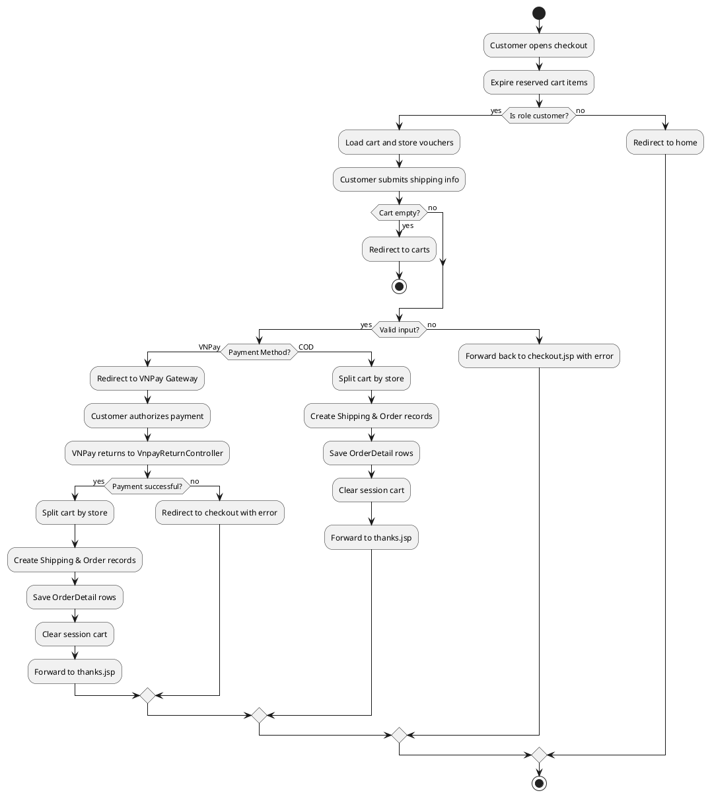

#### PlantUML: Checkout Sequence Diagram

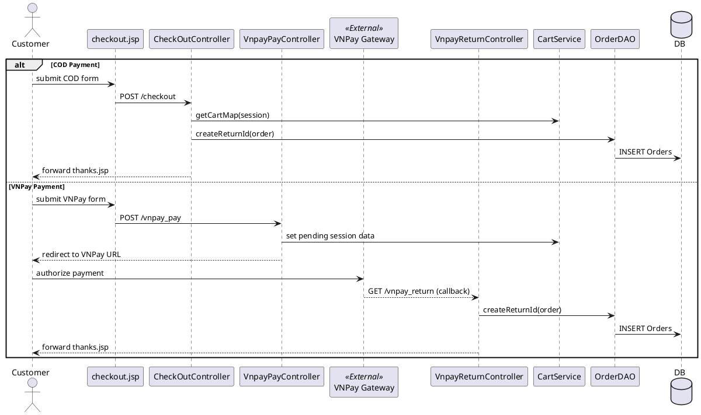

### 2.3 Order & Shipping Module

Main classes involved:

- `OrderController`
- `ShippingController`
- `OrderDAO`
- `ShippingDAO`
- `StoreDAO`
- `AcountDAO`
- `RoleHelper`

Design summary:

- `OrderController.doGet()` provides role-scoped order lists.
- Owners see orders of their store; shippers see only assigned orders.
- `OrderController.doPost()` supports `assignShipper` action with validation on owner role, store scope, valid shipper account, and shipped-state lock.
- `ShippingController.doGet()` allows owner to view shipping of owned store orders and shipper to view assigned shipping only.
- `ShippingController.doPost()` allows only shipper to update status.

#### PlantUML: Order & Shipping Class Diagram

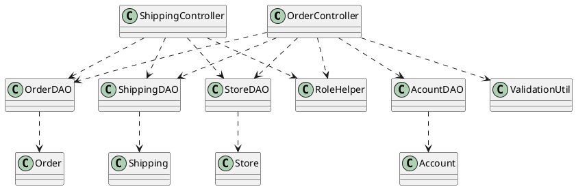

#### PlantUML: Assign Shipper Sequence Diagram

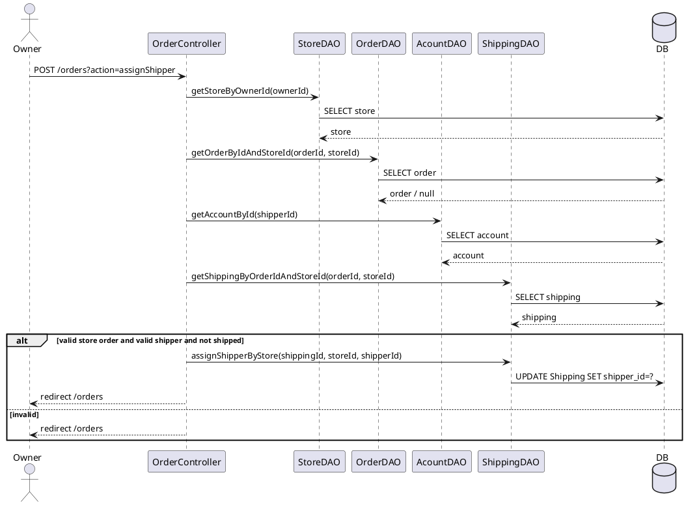

#### PlantUML: Shipping Update State/Flow

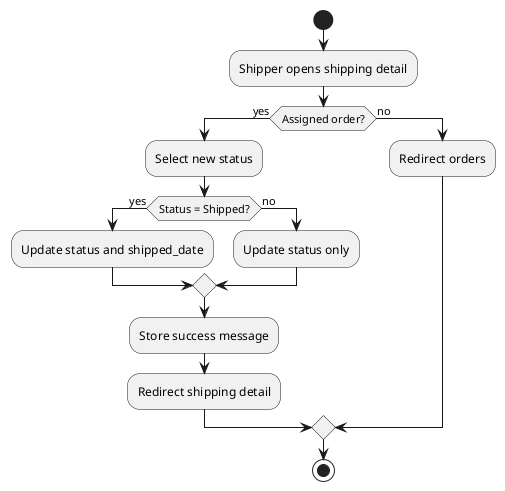

### 2.4 Product & Inventory Module

Main classes involved:

- `HomeController`
- `DetailController`
- `SearchController`
- `CategoryController`
- `AddProductController`
- `EditProductController`
- `DeleteProductController`
- `StockImportController`
- `StockHistoryController`
- `ProductDAO`
- `CategoryDAO`
- `StockImportDAO`

Design summary:

- Public product access is handled through home/search/category/detail controllers.
- Product management is used by owner/admin pages.
- `StockImportController` is warehouse-role protected and validates positive per-size quantities.
- Import notes can encode size distribution such as `Size 39: 5 doi, Size 40: 3 doi`.
- Successful stock import both creates a history record and updates available quantity.

#### PlantUML: Product & Inventory Class Diagram

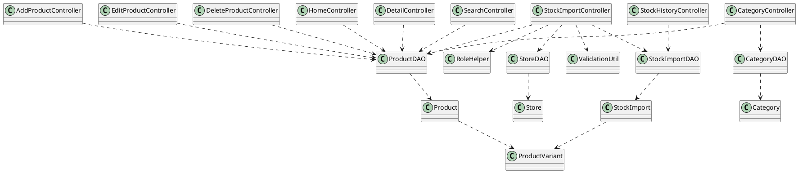

#### PlantUML: Stock Import Sequence Diagram

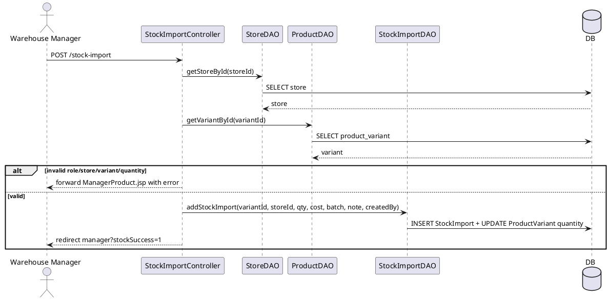

### 2.5 Administration & Reporting Module

Main classes involved:

- `ManagerAccountController`
- `EditAccountController`
- `ManagerCategoryController`
- `AddCategoryController`
- `EditCategoryController`
- `ManageStoreController`
- `ManagerStaffController`
- `VoucherController`
- `Statistic`
- `StatisticDAO`
- `StoreDAO`

Design summary:

- Admin pages cover account, store, voucher, statistics, news, contact, feedback, and homepage setting scopes.
- Owner-level administration overlaps with staff, store feedback, and selected content modules.
- Controllers in this feature enforce role-based access before loading or mutating management data.

#### PlantUML: Administration & Reporting Class Diagram

```plantuml
@startuml
skinparam classAttributeIconSize 0
skinparam shadowing false

class ManagerAccountController
class EditAccountController
class ManageStoreController
class ManagerStaffController
class ManagerNewsController
class ManagerContactController
class FeedbackManagerController
class ExportFeedbackController
class HomeSettingController
class VoucherController
class Statistic
class AcountDAO
class StoreDAO
class StaffActionHistoryDAO
class NewsDAO
class ContactDAO
class FeedbackDAO
class HomeSettingDAO
class SliderDAO
class ProductDAO
class VoucherDAO
class StatisticDAO
class Account
class Store
class News
class Contact
class Feedback
class HomeSetting
class Slider
class Product
class Voucher
class StaffActionHistory
class RoleHelper

ManagerAccountController ..> AcountDAO
EditAccountController ..> AcountDAO
ManageStoreController ..> StoreDAO
ManagerStaffController ..> AcountDAO
ManagerStaffController ..> StoreDAO
ManagerStaffController ..> StaffActionHistoryDAO
ManagerNewsController ..> NewsDAO
ManagerNewsController ..> StoreDAO
ManagerContactController ..> ContactDAO
ManagerContactController ..> StoreDAO
FeedbackManagerController ..> FeedbackDAO
ExportFeedbackController ..> FeedbackDAO
HomeSettingController ..> HomeSettingDAO
HomeSettingController ..> SliderDAO
HomeSettingController ..> ProductDAO
VoucherController ..> VoucherDAO
VoucherController ..> StoreDAO
Statistic ..> StatisticDAO

ManagerAccountController ..> RoleHelper
ManageStoreController ..> RoleHelper
ManagerStaffController ..> RoleHelper
ManagerNewsController ..> RoleHelper
ManagerContactController ..> RoleHelper
FeedbackManagerController ..> RoleHelper
HomeSettingController ..> RoleHelper
VoucherController ..> RoleHelper
Statistic ..> RoleHelper

AcountDAO ..> Account
StoreDAO ..> Store
NewsDAO ..> News
ContactDAO ..> Contact
FeedbackDAO ..> Feedback
HomeSettingDAO ..> HomeSetting
SliderDAO ..> Slider
ProductDAO ..> Product
VoucherDAO ..> Voucher
StaffActionHistoryDAO ..> StaffActionHistory
@enduml
```

#### PlantUML: Administration & Reporting Sequence Diagram

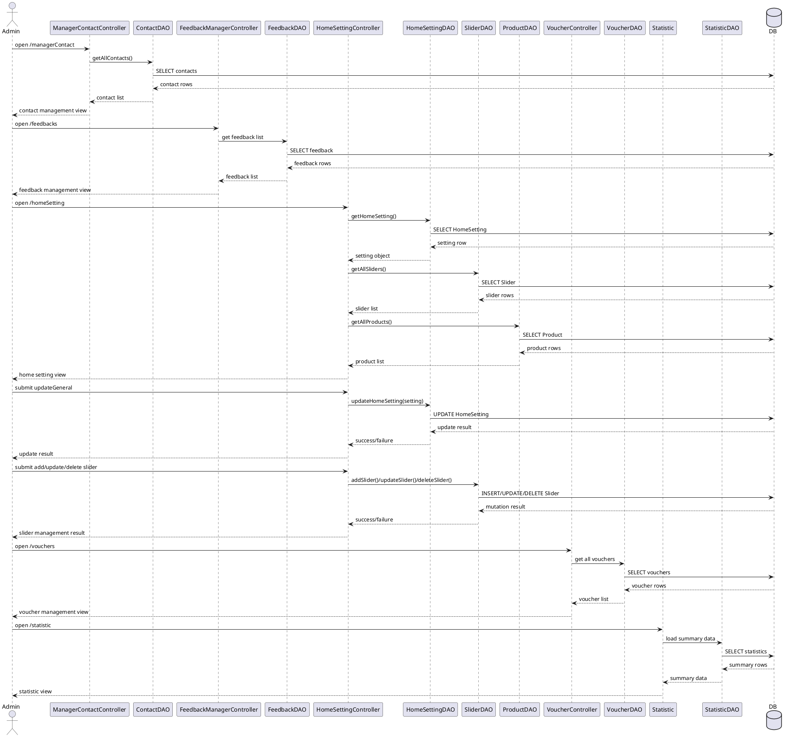
- `AcountDAO`

Design summary:

- Admin pages are protected by role checks and the `AdminFilter`.
- The administration area manages accounts, categories, stores, staff assignments, vouchers, and statistics.
- Statistics pages aggregate business data and present revenue/order summaries.
- Owner-level management overlaps with some modules such as orders, vouchers, and store-specific products.

## 3. PlantUML Appendix

This section is reserved for direct import into PlantUML tools.

Recommended diagrams to generate from this SDS:

- Architecture diagram
- Package diagram
- ERD overview
- Login sequence diagram
- Checkout activity diagram
- Checkout sequence diagram
- Assign shipper sequence diagram
- Shipping state diagram
- Account state diagram
- Stock import sequence diagram

Suggested usage:

1. Copy one `plantuml` block from this document.
2. Paste it into PlantUML Editor or draw.io PlantUML plugin.
3. Export to PNG/SVG and insert back into your Word report.
