# SOFTWARE REQUIREMENT SPECIFICATION

## Online Shoe Shopping System

Hanoi, Apr 2026

## Table of Contents

I. Record of Changes  
II. Software Requirement Specification  
1. Overall Requirements  
1.1 Context Diagram  
1.2 Main Business Processes  
1.3 User Requirements  
1.4 System Functionalities  
1.5 Entity Relationship Diagram  
2. Use Case Specifications  
2.1 Group 1: Shopping Experience  
2.2 Group 2: Account, Checkout & Profile  
2.3 Group 3: Product & Inventory Management  
2.4 Group 4: Order & Shipping Operations  
2.5 Group 5: Administration & Reporting  
3. Functional Requirements  
3.1 Group 1: Shopping Experience  
3.2 Group 2: Account, Checkout & Profile  
3.3 Group 3: Product & Inventory Management  
3.4 Group 4: Order & Shipping Operations  
3.5 Group 5: Administration & Reporting  
3.6 Wireframe Headings  
4. Non-Functional Requirements  
4.1 External Interfaces  
4.2 Quality Attributes  
5. Requirement Appendix  
5.1 Business Rules  
5.2 System Messages  
5.3 Other Requirements  
6. Script SQL

## I. Record of Changes

| Date | A/M/D | In charge | Change Description |
|---|---|---|---|
| Apr 25, 2026 | A | Codex | Created initial SRS for Online Shoe Shopping System based on project scope and SRS template structure. |
| Apr 25, 2026 | A | Codex | Defined actors, use cases, functional requirements, non-functional requirements, and business rules for 5-role architecture: Admin, Owner, Shipper, Warehouse Manager, Customer. |

`A - Added, M - Modified, D - Deleted`

## II. Software Requirement Specification

## 1. Overall Requirements

### 1.1 Context Diagram

The Online Shoe Shopping System exchanges data with external users and external services during shopping, store operations, shipping, and administration.

External entities interacting with the system:

- `Customer`: browses shoes, manages cart, places orders, tracks purchases, gives feedback.
- `Owner`: manages one store, products, vouchers, news, contacts, staff assignments, and store orders.
- `Warehouse Manager`: manages stock import history and inventory quantity for the assigned store.
- `Shipper`: views assigned deliveries and updates shipping status.
- `Admin`: manages accounts, stores, system news, vouchers, contact records, statistics, and overall system administration scope.
- `Email Service`: used for account activation, OTP, and password reset flows.
- `Payment Gateway (future/partial)`: reserved for online payment integration such as VNPay.
- `Database`: stores accounts, stores, products, carts, orders, shipping, vouchers, inventory imports, feedback, and support contacts.

#### PlantUML: Context Diagram

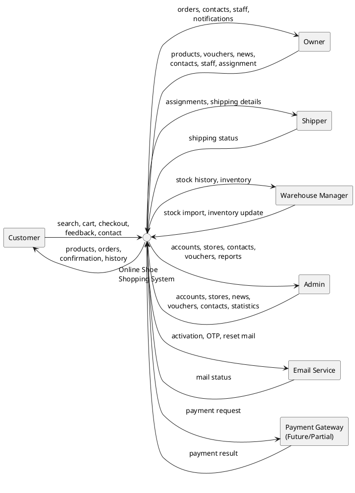

### 1.2 Main Business Processes

#### 1.2.1 Customer Purchase Flow

Workflow steps:

1. Customer opens the website and browses shoe products by category, keyword, or featured list.
2. Customer views product detail including image, name, description, price, store, and stock quantity.
3. Customer logs in or registers an account if they want to purchase.
4. Customer adds one or more shoe items to the cart.
5. System reserves stock and stores cart data in session/database.
6. Customer updates quantities, removes items, and proceeds to checkout.
7. Customer enters shipping information and optional voucher codes.
8. System validates cart, stock, shipping information, and applicable discount rules.
9. System creates shipping, order, and order detail records. For multi-store carts, the system separates them into store-specific orders.
10. Owner reviews orders for the store and assigns a shipper if needed.
11. Shipper receives delivery assignment and updates shipping status.
12. Customer can later review order history, shipping status, and submit feedback/contact requests.

#### PlantUML: Customer Purchase Activity

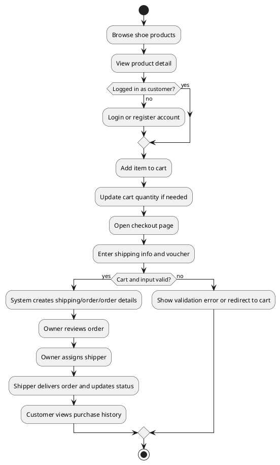

#### 1.2.2 Inventory Management Flow

1. Owner maintains store products and vouchers, while Admin maintains store/account level administration and system content scope.
2. Warehouse Manager imports stock for shoes of the assigned store.
3. System records stock import history and updates available quantity.
4. Customer purchases consume available stock.
5. Cart expiration or quantity reduction releases reserved stock back to inventory.

#### PlantUML: Inventory Management Activity

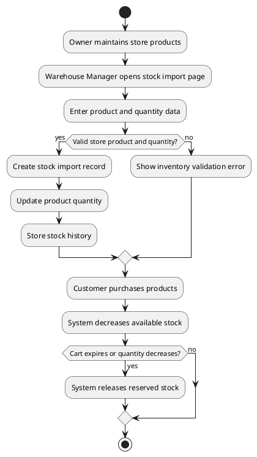

#### 1.2.3 Order Fulfillment Flow

1. After checkout, order records are created per store.
2. Owner reviews store orders.
3. Owner assigns an available shipper to a shipping record.
4. Shipper views assigned orders only.
5. Shipper updates shipping status from pending to delivering to shipped.
6. Customer views updated status in purchase history.

#### PlantUML: Order Fulfillment Activity

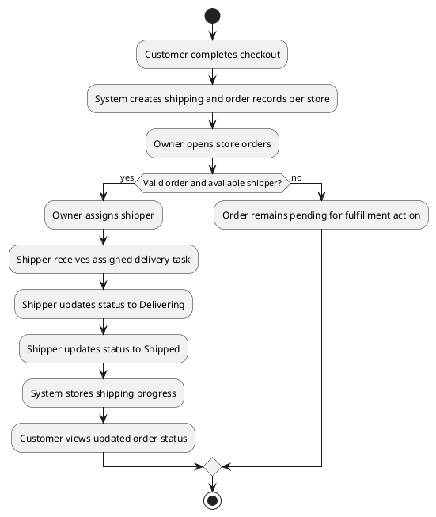

### 1.3 User Requirements

#### 1.3.1 Actors

| # | Actor | Description |
|---|---|---|
| 1 | Guest | Unauthenticated user who can browse products, search, and view shoe details. |
| 2 | Customer | Registered buyer who can manage account, cart, checkout, purchase history, contact, and feedback. |
| 3 | Owner | Store owner who manages one store, including products, vouchers, news, contacts, staff accounts, and store orders. |
| 4 | Warehouse Manager | Staff role responsible for stock import and inventory updates of an assigned store. |
| 5 | Shipper | Staff role responsible for viewing assigned deliveries and updating shipping status. |
| 6 | Admin | System administrator with authority over accounts, stores, system news, system vouchers, statistics, and all contact records. |

#### 1.3.2 Use Cases (UC)

| ID | Use Case | Use Case Description |
|---|---|---|
| UC-01 | View Home Page | Guest or authenticated user views homepage, featured shoes, sliders, and promotions. |
| UC-02 | Search Product | User searches shoes by keyword. |
| UC-03 | Filter by Category | User filters products by category or manufacturer/brand. |
| UC-04 | View Product Detail | User views detail information of a shoe product. |
| UC-05 | Register Account | Guest creates a new customer account. |
| UC-06 | Activate Account | User activates account through email token. |
| UC-07 | Login | User logs in with valid credentials and role-based session data is created. |
| UC-08 | Logout | Authenticated user ends the session. |
| UC-09 | Forgot Password | User requests OTP or reset flow via email. |
| UC-10 | Reset Password | User verifies OTP and sets a new password. |
| UC-11 | View Profile | Authenticated user views profile details. |
| UC-12 | Edit Profile | Authenticated user updates personal information. |
| UC-13 | Add to Cart | Customer adds a shoe item to cart. |
| UC-14 | Update Cart Quantity | Customer changes cart quantity or removes an item. |
| UC-15 | View Cart | Customer views reserved items and totals. |
| UC-16 | Checkout | Customer enters shipping information and places an order. |
| UC-17 | Apply Voucher | Customer uses a valid voucher during checkout. |
| UC-18 | View Purchase History | Customer views previous and current orders. |
| UC-19 | View Order Detail | Customer views details of one order. |
| UC-20 | Submit Feedback | Customer sends rating and review for a purchased product. |
| UC-21 | Send Support Contact | Customer sends a support message related to an order. |
| UC-22 | View Store Orders | Owner views orders of the owned store. |
| UC-23 | Assign Shipper | Owner assigns a shipper to a store order. |
| UC-24 | Manage Store Products | Owner adds, edits, or deletes shoe products of the owned store. |
| UC-25 | Manage Store Vouchers | Owner manages vouchers for the owned store. |
| UC-26 | Manage Store News | Owner manages news posts of the owned store. |
| UC-27 | Manage Store Contacts | Owner reviews and responds to contact/support requests of the owned store. |
| UC-28 | Manage Staff Accounts | Owner creates and updates staff accounts of the owned store. |
| UC-29 | Manage Store Feedback | Owner reviews and manages feedback of the owned store. |
| UC-30 | Manage Inventory | Warehouse Manager imports stock and checks inventory history. |
| UC-31 | View Shipping Tasks | Shipper views assigned delivery tasks. |
| UC-32 | Update Shipping Status | Shipper updates shipping progress for assigned orders. |
| UC-33 | Manage Accounts | Admin manages system accounts and activation/lock status. |
| UC-34 | Manage Stores | Admin manages store assignments and store information. |
| UC-35 | Manage System News | Admin manages system-wide or all-news content. |
| UC-36 | Manage All Contacts | Admin monitors and processes all support/contact records. |
| UC-37 | Manage System Vouchers | Admin manages vouchers across the system. |
| UC-38 | View Statistics | Admin views system statistics and reporting data. |
| UC-39 | Manage All Feedback | Admin reviews and manages feedback across the system. |
| UC-40 | Manage Home Setting | Admin manages homepage content and display settings. |

#### 1.3.3 Use Case Diagrams

The use case diagrams below are separated by actor as requested for clearer report presentation.

#### PlantUML: Guest Use Case Diagram

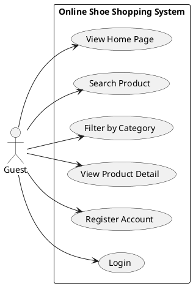

#### PlantUML: Customer Use Case Diagram

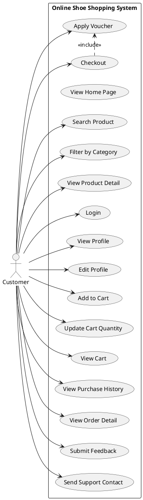

#### PlantUML: Owner Use Case Diagram

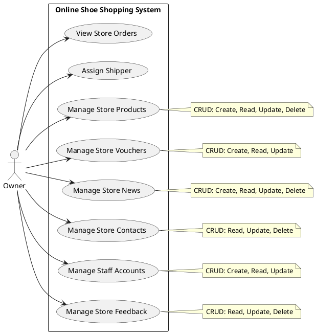

#### PlantUML: Warehouse Manager Use Case Diagram

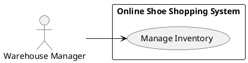

#### PlantUML: Shipper Use Case Diagram

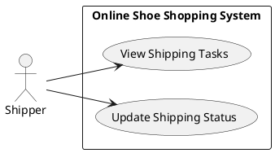

#### PlantUML: Admin Use Case Diagram

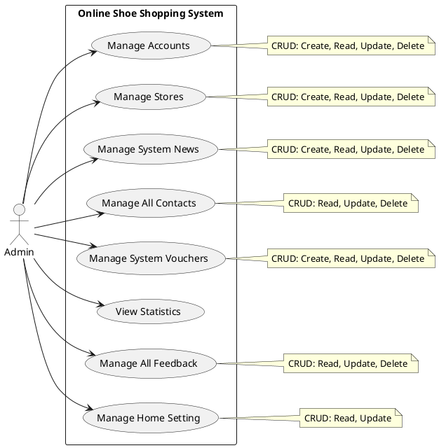

### 1.4 System Functionalities

#### 1.4.1 Screen Flow

Main screen flow:

1. `Home` -> `Product Detail` -> `Login/Register` -> `Cart` -> `Checkout` -> `Thank You` -> `Purchase History`
2. `Owner Dashboard` -> `Orders / News / Contacts / Feedback / Staff / Products / Vouchers`
3. `Warehouse Manager Dashboard` -> `Stock Import` -> `Stock History`
4. `Admin Dashboard` -> `Accounts / Stores / News / Contacts / Vouchers / Statistics / Feedback / Home Setting`

#### PlantUML: Screen Flow Diagram

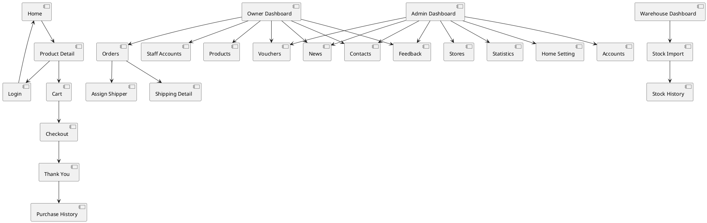

#### 1.4.2 Screen Authorization

| Screen | Guest | Customer | Owner | Warehouse Manager | Shipper | Admin |
|---|---|---|---|---|---|---|
| Home Page | X | X | X | X | X | X |
| Product Detail | X | X | X | X | X | X |
| Login / Signup / Reset Password | X | X | X | X | X | X |
| Cart / Checkout |  | X |  |  |  |  |
| Profile / Purchase History |  | X | X | X | X | X |
| Order Management |  |  | X |  | X |  |
| Shipping Detail |  |  | X |  | X |  |
| Product Management |  |  | X |  |  |  |
| Voucher Management |  |  | X |  |  | X |
| News Management |  |  | X |  |  | X |
| Contact Management |  |  | X |  |  | X |
| Feedback Management |  |  | X |  |  | X |
| Staff Account Management |  |  | X |  |  |  |
| Stock Import / Stock History |  |  |  | X |  |  |
| Account Management |  |  |  |  |  | X |
| Store Management |  |  |  |  |  | X |
| Statistics |  |  |  |  |  | X |
| Home Setting Management |  |  |  |  |  | X |

#### 1.4.3 Non-UI Functions

| # | Feature | System Function | Description |
|---|---|---|---|
| 1 | Authentication | Email token/OTP | Supports account activation and password reset verification. |
| 2 | Cart | Stock reservation | Reserves product quantity when customer adds to cart and releases it on expiry or update. |
| 3 | Checkout | Store split logic | Creates separate orders and shipping records per store in one checkout flow. |
| 4 | Shipping | Role-based access control | Ensures only owner or assigned shipper can view/update shipping records. |
| 5 | Inventory | Stock import history | Records import quantity, note, store, and creator. |
| 6 | Promotion | Voucher validation | Checks code validity, expiration date, discount percent, max discount, and minimum order value. |
| 7 | Content & Support | News/contact management | Supports role-scoped news management and support/contact processing for admin and owner. |

### 1.5 Entity Relationship Diagram

Core entities in the system:

| # | Entity | Description |
|---|---|---|
| 1 | Role | Stores role keys such as `admin`, `owner`, `shipper`, `warehouse_manager`, and `customer`. |
| 2 | Account | Stores login credentials, status, role, name, phone, email, address, and token. |
| 3 | Store | Represents one shoe store. |
| 4 | StoreStaff | Stores staff assignments (shipper, warehouse manager) to stores. |
| 5 | Manufacturer | Stores product brands/manufacturers. |
| 6 | Category | Stores shoe categories. |
| 7 | Product | Stores general shoe information. |
| 8 | Color | Stores variant colors. |
| 9 | ProductVariant | Stores specific size/color variants with price and quantity. |
| 10 | Cart | Stores reserved product items of customers. |
| 11 | Shipping | Stores delivery information and status. |
| 12 | StockImport | Stores inventory import records (In Cost tracking). |
| 13 | Orders | Stores order header data. |
| 14 | OrderDetail | Stores purchased item snapshots. |
| 15 | Voucher | Stores discount code rules. |
| 16 | Feedback | Stores product reviews and ratings. |
| 17 | Contact | Stores customer support messages. |
| 18 | News | Stores news posts. |
| 19 | StaffActionHistory | Stores owner actions on staff. |
| 20 | HomeSetting / Slide | Stores homepage content display data. |

Entity relationships summary:

- One `Role` can be assigned to many `Account` records.
- One `Store` links to an `Owner` and many `StoreStaff`.
- One `Store` has many `Category`, `Product`, `Voucher`, `Shipping`, `StockImport`, `Feedback`, `News`, and `Contact` records.
- One `Product` has many `ProductVariant` records, which link to `Color`.
- One `Customer Account` can have many `Cart`, `Orders`, `Feedback`, and `Contact` records.
- One `Order` has many `OrderDetail` rows and links to one `Shipping` record.
- `StockImport` tracks the inventory history for each `ProductVariant`.

#### PlantUML: ERD Overview

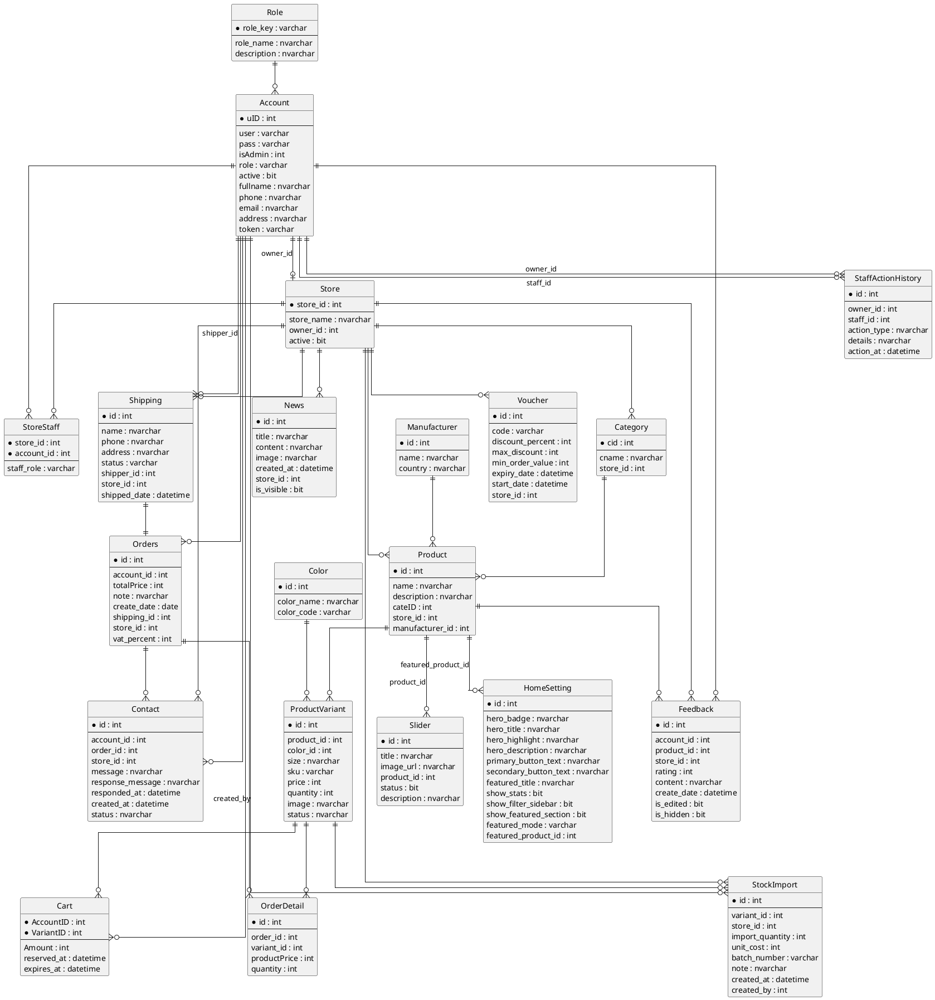

## 2. Use Case Specifications

### 2.1 Group 1: Shopping Experience

#### UC-01 View Home Page

Primary Actors
`Guest`

Secondary Actors
`Customer`

Description
As a Guest/Customer, I want to view the home page so that I can quickly see promotions, featured products, latest products, and main categories.

Preconditions
`None.`

Postconditions
The Home Page is displayed with current banners, latest products, featured products, and category navigation.

Normal Sequence/Flow
1. Guest opens the website root URL or clicks the Home link.
2. System displays the Home Page with active promotional banners.
3. System displays featured products, latest products, and category shortcuts on the same screen.

Alternative Sequences/Flows
2.1 Content Load Error: System cannot load one or more home sections.
2.1.1 System shows fallback content or a friendly message (e.g., "Unable to load products right now").
2.1.2 Guest can refresh the page to retry, then resume at Step 1.

#### UC-02 Search Product

Primary Actors
`Guest`

Secondary Actors
`Customer`

Description
As a Guest/Customer, I want to search products so that I can quickly find shoes matching my keyword.

Preconditions
Product data exists.

Postconditions
Matching product list or empty-safe state is displayed.

Normal Sequence/Flow
1. Guest enters a keyword in the search box.
2. System validates and normalizes the keyword.
3. System queries matching shoe products.
4. System displays the result list.

Alternative Sequences/Flows
3.1 No matching product: system shows an empty-safe result page.

#### UC-04 View Product Detail

Primary Actors
`Guest`

Secondary Actors
`Customer`

Description
As a Guest/Customer, I want to view product details so that I can inspect price, stock, and feedback before buying.

Preconditions
Product ID is supplied.

Postconditions
Product detail information is displayed or a safe fallback state is shown.

Normal Sequence/Flow
1. Guest opens a product detail page.
2. System loads product information, store data, stock state, and feedback.
3. System displays the product detail page.
4. Customer may continue to add the product to cart if eligible.

Alternative Sequences/Flows
1.1 Invalid product ID: system redirects or shows a safe fallback state.

#### UC-13 Add to Cart

Primary Actors
`Customer`

Secondary Actors
`None`

Description
As a Customer, I want to add products to cart so that I can purchase them later in checkout.

Preconditions
Customer is logged in; product exists; stock is available.

Postconditions
Cart is updated and stock reservation is reflected.

Normal Sequence/Flow
1. Customer chooses a shoe product.
2. Customer triggers add-to-cart action.
3. System validates role and stock quantity.
4. System reserves stock.
5. System inserts or updates the cart line.
6. System redirects customer back with success feedback.

Alternative Sequences/Flows
2.1 Customer is not authenticated or not a customer: system denies the action.
2.2 Product is out of stock: system rejects the action.
2.3 Product ID is invalid: system shows a safe error message.

#### PlantUML: Add To Cart Activity

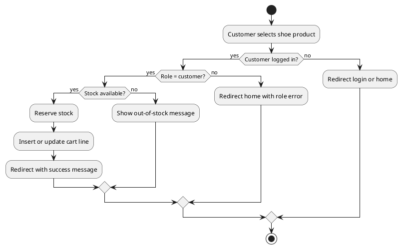

### 2.2 Group 2: Account, Checkout & Profile

#### UC-05 Register Account

Primary Actors
`Guest`

Secondary Actors
`Email Service`

Description
As a Guest, I want to register an account so that I can place orders and manage my profile.

Preconditions
Guest is on the registration page and is not logged in.

Postconditions
New account is created and user can access account features after activation flow.

Normal Sequence/Flow
1. Guest opens Register page and enters required information.
2. Guest submits the form.
3. System validates required fields and business rules.
4. System creates an inactive customer account with activation token.
5. System sends activation email.
6. System shows registration success message and redirects guest to Login.

Alternative Sequences/Flows
2.1 Email or username already used: system shows duplicate warning and keeps user on Register.
2.2 Invalid form data: system shows validation messages.
2.3 Registration currently unavailable: system shows explanatory message and does not complete registration.
2.1.1 Guest corrects data and retries.

#### UC-07 Login

Primary Actors
`Customer`, `Owner`, `Shipper`, `Warehouse Manager`, `Admin`

Secondary Actors
`None`

Description
As a registered user, I want to log in so that I can access my permitted role-based features.

Preconditions
User account exists and user is currently logged out.

Postconditions
Authenticated session is created if login succeeds.

Normal Sequence/Flow
1. User opens the Login page.
2. User enters username and password.
3. User submits the login form.
4. System validates credentials.
5. System checks account active status.
6. System creates session data including role and store-related context.
7. System optionally stores remember-username cookie.
8. System redirects user to home page.

Alternative Sequences/Flows
4.1 Invalid credentials: system returns login error.
5.1 Inactive account: system denies access and shows inactive message.

#### UC-16 Checkout

Primary Actors
`Customer`

Secondary Actors
`None`

Description
As a Customer, I want to complete checkout so that I can place my order successfully.

Preconditions
Logged-in customer has a non-empty cart.

Postconditions
One or more orders are created and cart is cleared.

Normal Sequence/Flow
1. Customer opens checkout page.
2. System loads cart total and applicable store vouchers.
3. Customer enters shipping information.
4. Customer submits checkout.
5. System validates cart, shipping data, and discount rules.
6. System splits cart by store.
7. System creates shipping, order, and order detail records for each store.
8. System clears cart session data.
9. System shows thank-you page.

Alternative Sequences/Flows
4.1 Empty cart: system redirects back to cart.
5.1 Invalid shipping information: system reloads checkout with errors.
5.2 Invalid voucher: system continues without invalid discount.

#### PlantUML: Checkout Use Case Flow

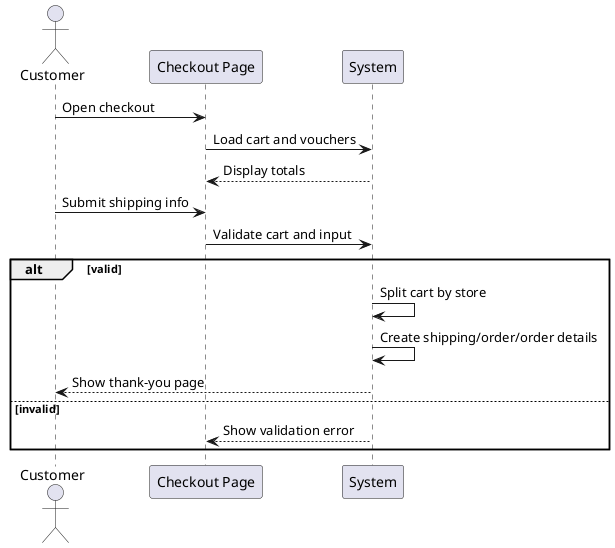

#### UC-18 View Purchase History

Primary Actors
`Customer`

Secondary Actors
`None`

Description
As a Customer, I want to view my purchase history so that I can review past and current orders.

Preconditions
Customer is authenticated.

Postconditions
Purchase history information is displayed.

Normal Sequence/Flow
1. Customer opens purchase history page.
2. System loads orders of the customer.
3. System loads related shipping data and support/contact data.
4. Customer reviews order history and chooses further actions if needed.

Alternative Sequences/Flows
2.1 No orders found: system shows an empty-safe state.

### 2.3 Group 3: Product & Inventory Management

#### UC-24 Manage Store Products

Primary Actors
`Owner`

Secondary Actors
`None`

Description
As an Owner, I want to manage store products so that I can maintain the product catalog of my store.

Preconditions
Owner is authenticated and mapped to a store.

Postconditions
Product data of the owned store is updated.

Normal Sequence/Flow
1. Owner opens product management page.
2. System loads products of the owned store.
3. Owner adds, edits, or deletes a product.
4. System validates product data.
5. System saves changes.

Alternative Sequences/Flows
4.1 Invalid product data: system returns validation message.

#### UC-25 Manage Store Vouchers

Primary Actors
`Owner`

Secondary Actors
`None`

Description
As an Owner, I want to manage store vouchers so that I can apply promotions to products in my store.

Preconditions
Owner is authenticated and mapped to a store.

Postconditions
Voucher data is updated for the owned store.

Normal Sequence/Flow
1. Owner opens voucher management page.
2. System loads vouchers of the owned store.
3. Owner creates or edits voucher rules.
4. System validates discount values, dates, and store scope.
5. System saves voucher data.

Alternative Sequences/Flows
4.1 Invalid voucher rule values: system shows validation message.

#### UC-26 Manage Store News

Primary Actors
`Owner`

Secondary Actors
`None`

Description
As an Owner, I want to manage store news so that I can publish announcements and promotional content for my store.

Preconditions
Owner is authenticated and mapped to a store.

Postconditions
Store news content is updated.

Normal Sequence/Flow
1. Owner opens news management page.
2. System loads only news of the owned store.
3. Owner adds, edits, or toggles visibility of store news.
4. System saves the updated news data.

Alternative Sequences/Flows
3.1 Invalid news data: system shows validation message and keeps owner on the page.

#### UC-27 Manage Store Contacts

Primary Actors
`Owner`

Secondary Actors
`None`

Description
As an Owner, I want to manage store contacts so that I can process customer support requests of my store.

Preconditions
Owner is authenticated and mapped to a store.

Postconditions
Contact record processing state is updated.

Normal Sequence/Flow
1. Owner opens contact management page.
2. System loads support/contact records of the owned store.
3. Owner updates status, responds, or removes a record according to allowed flow.
4. System saves the update.

Alternative Sequences/Flows
3.1 Invalid response data: system shows validation feedback and does not complete the update.

#### UC-28 Manage Staff Accounts

Primary Actors
`Owner`

Secondary Actors
`None`

Description
As an Owner, I want to manage staff accounts so that I can assign and maintain shipper and warehouse manager roles for my store.

Preconditions
Owner is authenticated and mapped to a store.

Postconditions
Staff account data and staff history are updated.

Normal Sequence/Flow
1. Owner opens staff management page.
2. System loads current staff and staff action history.
3. Owner adds or edits a staff account.
4. System validates account data.
5. System updates staff assignment and writes history log.

Alternative Sequences/Flows
4.1 Duplicate username/email: system returns validation error.

#### UC-29 Manage Store Feedback

Primary Actors
`Owner`

Secondary Actors
`None`

Description
As an Owner, I want to manage store feedback so that I can moderate customer reviews related to my store.

Preconditions
Owner is authenticated and mapped to a store.

Postconditions
Feedback state is updated for store scope.

Normal Sequence/Flow
1. Owner opens feedback management page.
2. System loads feedback records of the owned store.
3. Owner reviews, edits, hides, or exports feedback.
4. System saves moderation changes.

Alternative Sequences/Flows
3.1 Invalid moderation action: system rejects the action and keeps the current state.

#### UC-30 Manage Inventory

Primary Actors
`Warehouse Manager`

Secondary Actors
`None`

Description
As a Warehouse Manager, I want to manage inventory so that I can import stock and update available quantities for my store.

Preconditions
Warehouse manager is assigned to one store.

Postconditions
Inventory quantity and stock history are updated.

Normal Sequence/Flow
1. Warehouse manager opens stock import page.
2. User selects a product and enters quantity data.
3. System validates store scope and quantity.
4. System inserts stock import history.
5. System updates product quantity.
6. User can later review stock history.

Alternative Sequences/Flows
3.1 Invalid quantity or wrong store product: system rejects the request.

### 2.4 Group 4: Order & Shipping Operations

#### UC-22 View Store Orders

Primary Actors
`Owner`, `Shipper`

Secondary Actors
`None`

Description
As an Owner/Shipper, I want to view orders so that I can handle store fulfillment or assigned delivery tasks.

Preconditions
Actor is authenticated with proper role.

Postconditions
Order list is displayed according to role scope.

Normal Sequence/Flow
1. Actor opens orders page.
2. System checks role.
3. If actor is owner, system loads store orders and shipper list.
4. If actor is shipper, system loads assigned orders only.

Alternative Sequences/Flows
2.1 Unauthorized role: system denies access and redirects safely.

#### UC-23 Assign Shipper

Primary Actors
`Owner`

Secondary Actors
`None`

Description
As an Owner, I want to assign a shipper so that a store order can move into delivery processing.

Preconditions
Order belongs to owner store and is not already shipped.

Postconditions
Shipping assignment is updated if validation passes.

Normal Sequence/Flow
1. Owner selects an order.
2. Owner selects a valid shipper of the store.
3. System validates store scope and shipper role.
4. System updates shipping assignment.
5. System redirects back to orders list.

Alternative Sequences/Flows
3.1 Invalid shipper or foreign order: system rejects the update.

#### UC-31 View Shipping Tasks

Primary Actors
`Shipper`

Secondary Actors
`None`

Description
As a Shipper, I want to view shipping tasks so that I can process only the deliveries assigned to me.

Preconditions
Shipper is authenticated.

Postconditions
Assigned order tasks are displayed.

Normal Sequence/Flow
1. Shipper opens orders page.
2. System loads assigned orders only.
3. Shipper chooses one order to inspect shipping detail.

Alternative Sequences/Flows
2.1 No assigned task: system shows an empty-safe task list.

#### UC-32 Update Shipping Status

Primary Actors
`Shipper`

Secondary Actors
`None`

Description
As a Shipper, I want to update shipping status so that delivery progress is reflected in the system.

Preconditions
Shipping record is assigned to current shipper.

Postconditions
Shipping status is updated.

Normal Sequence/Flow
1. Shipper opens shipping detail.
2. Shipper selects a new status.
3. System validates permission.
4. System updates shipping status.
5. System stores success message and shows updated detail.

Alternative Sequences/Flows
3.1 Shipment is not assigned to current shipper: system denies the update.

#### PlantUML: Shipping State Diagram

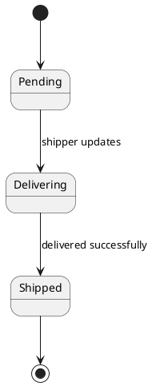

### 2.5 Group 5: Administration & Reporting

#### UC-33 Manage Accounts

Primary Actors
`Admin`

Secondary Actors
`None`

Description
As an Admin, I want to manage accounts so that I can maintain system user access and account status.

Preconditions
Admin is authenticated.

Postconditions
Account data is updated if action is valid.

Normal Sequence/Flow
1. Admin opens account management page.
2. System loads account list.
3. Admin searches, edits, activates, deactivates, or reviews account details.
4. System saves changes.

Alternative Sequences/Flows
3.1 Invalid account data: system rejects the update and shows validation feedback.

#### UC-34 Manage Stores

Primary Actors
`Admin`

Secondary Actors
`None`

Description
As an Admin, I want to manage stores so that I can maintain store information and role assignments.

Preconditions
Admin is authenticated.

Postconditions
Store data is updated.

Normal Sequence/Flow
1. Admin opens store management page.
2. System loads stores and role assignments.
3. Admin creates or updates store information and mappings.
4. System saves changes.

Alternative Sequences/Flows
3.1 Invalid mapping or missing required data: system rejects the update.

#### UC-35 Manage System News

Primary Actors
`Admin`

Secondary Actors
`None`

Description
As an Admin, I want to manage system news so that I can control system-wide and store-related news content.

Preconditions
Admin is authenticated.

Postconditions
News content is updated.

Normal Sequence/Flow
1. Admin opens news management page.
2. System loads all news records.
3. Admin adds, edits, or toggles news visibility.
4. System saves the update.

Alternative Sequences/Flows
3.1 Invalid news content: system rejects the action and shows validation feedback.

#### UC-36 Manage All Contacts

Primary Actors
`Admin`

Secondary Actors
`None`

Description
As an Admin, I want to manage all contacts so that I can process support requests across all stores.

Preconditions
Admin is authenticated.

Postconditions
Contact records are updated.

Normal Sequence/Flow
1. Admin opens contact management page.
2. System loads all support/contact records.
3. Admin updates status, responds, or removes records according to flow.
4. System saves changes.

Alternative Sequences/Flows
3.1 Invalid processing action: system rejects the action and keeps current contact state.

#### UC-37 Manage System Vouchers

Primary Actors
`Admin`

Secondary Actors
`None`

Description
As an Admin, I want to manage system vouchers so that I can maintain promotional rules across the system.

Preconditions
Admin is authenticated.

Postconditions
Voucher data is updated.

Normal Sequence/Flow
1. Admin opens voucher management page.
2. System loads voucher records across the system.
3. Admin creates, edits, or reviews vouchers.
4. System validates and saves voucher data.

Alternative Sequences/Flows
3.1 Invalid voucher data: system rejects the update and shows validation feedback.

#### UC-38 View Statistics

Primary Actors
`Admin`

Secondary Actors
`None`

Description
As an Admin, I want to view statistics so that I can monitor overall system performance and business activity.

Preconditions
Admin is authenticated.

Postconditions
Statistics data is displayed.

Normal Sequence/Flow
1. Admin opens statistic page.
2. System loads system-wide summary data.
3. Admin reviews reporting metrics and summaries.

Alternative Sequences/Flows
2.1 No report data available: system shows an empty-safe reporting state.

#### UC-39 Manage All Feedback

Primary Actors
`Admin`

Secondary Actors
`None`

Description
As an Admin, I want to manage all feedback so that I can moderate reviews across the whole system.

Preconditions
Admin is authenticated.

Postconditions
Feedback moderation data is updated.

Normal Sequence/Flow
1. Admin opens feedback management page.
2. System loads feedback records across all stores.
3. Admin reviews, edits, hides, exports, or moderates feedback.
4. System saves moderation changes.

Alternative Sequences/Flows
3.1 Invalid moderation action: system rejects the request and keeps current feedback state.

#### UC-40 Manage Home Setting

Primary Actors
`Admin`

Secondary Actors
`None`

Description
As an Admin, I want to manage home settings so that I can control homepage content and display behavior.

Preconditions
Admin is authenticated.

Postconditions
Homepage configuration is updated.

Normal Sequence/Flow
1. Admin opens home setting management page.
2. System loads homepage content and display settings.
3. Admin updates homepage text, featured configuration, visibility settings, or display options.
4. System saves homepage settings.

Alternative Sequences/Flows
3.1 Invalid setting data: system rejects the update and shows validation feedback.

#### PlantUML: Shipping State Diagram


#### Legacy note removed

The admin scope in this SRS includes `account`, `store`, `news`, `voucher`, `contact`, `statistics`, `feedback`, and `home setting`, while `Owner` manages store operations, feedback, and staff.

## 3. Functional Requirements

### 3.1 Group 1: Shopping Experience

| ID | Requirement |
|---|---|
| FR-01 | The system shall display a homepage containing featured shoe products, banners, and configurable homepage content. |
| FR-02 | The system shall allow users to search shoe products by keyword. |
| FR-03 | The system shall allow users to filter products by category. |
| FR-04 | The system shall display detailed information for each shoe product. |
| FR-05 | The system shall prevent adding out-of-stock products to the cart. |
| FR-06 | The system shall only allow `customer` role to perform add-to-cart and checkout actions. |
| FR-07 | The system shall reserve stock when a customer adds a product to the cart. |
| FR-08 | The system shall release reserved stock when quantity is reduced, removed, or expired. |

### 3.2 Group 2: Account, Checkout & Profile

| ID | Requirement |
|---|---|
| FR-09 | The system shall allow guests to register a new customer account. |
| FR-10 | The system shall validate duplicate username and duplicate email during registration. |
| FR-11 | The system shall support account activation using token-based verification. |
| FR-12 | The system shall block login for inactive accounts. |
| FR-13 | The system shall support remember-username cookie during login. |
| FR-14 | The system shall support forgot-password and OTP/reset-password flow. |
| FR-15 | The system shall allow authenticated users to view and update profile information. |
| FR-16 | The system shall show cart contents and calculated totals before checkout. |
| FR-17 | The system shall validate shipping name, phone, and address during checkout. |
| FR-18 | The system shall create shipping, order, and order detail records after successful checkout. |
| FR-19 | The system shall split one checkout into separate orders by store when the cart contains products from multiple stores. |
| FR-20 | The system shall clear cart data after successful checkout. |
| FR-21 | The system shall allow customers to view purchase history and order-related shipping data. |
| FR-22 | The system shall allow customers to submit feedback and support contact requests. |

### 3.3 Group 3: Product & Inventory Management

| ID | Requirement |
|---|---|
| FR-23 | The system shall allow Owner to add, edit, and delete products of the owned store. |
| FR-24 | The system shall allow Owner to create and update vouchers of the owned store. |
| FR-25 | The system shall allow Owner to create, edit, and toggle visibility of store news. |
| FR-26 | The system shall allow Owner to process store contact/support records. |
| FR-27 | The system shall allow Owner to create and update shipper or warehouse manager accounts for the owned store. |
| FR-28 | The system shall allow Owner to review and manage feedback belonging to the owned store. |
| FR-29 | The system shall allow Warehouse Manager to import stock for the assigned store. |
| FR-30 | The system shall store stock import history including quantity, note, creator, and timestamp. |
| FR-31 | The system shall update product quantity after stock import. |

### 3.4 Group 4: Order & Shipping Operations

| ID | Requirement |
|---|---|
| FR-32 | The system shall allow Owner to view only orders belonging to the owned store. |
| FR-33 | The system shall allow Shipper to view only assigned orders. |
| FR-34 | The system shall allow Owner to assign a valid shipper to an order of the same store. |
| FR-35 | The system shall prevent invalid shipper assignment for foreign or unauthorized orders. |
| FR-36 | The system shall allow Owner or assigned Shipper to view shipping detail for an order. |
| FR-37 | The system shall allow only the assigned Shipper to update shipping status. |
| FR-38 | The system shall block customers and unauthorized users from accessing order and shipping management pages. |

### 3.5 Group 5: Administration & Reporting

| ID | Requirement |
|---|---|
| FR-39 | The system shall allow Admin to manage system accounts. |
| FR-40 | The system shall allow Admin to manage stores and store-role assignments. |
| FR-41 | The system shall allow Admin to manage system-wide news content. |
| FR-42 | The system shall allow Admin to monitor and process contact/support records across all stores. |
| FR-43 | The system shall allow Admin to manage vouchers across the system scope. |
| FR-44 | The system shall allow Admin to view system statistics and reporting pages. |
| FR-45 | The system shall allow Admin to review and manage feedback across the system. |
| FR-46 | The system shall allow Admin to manage homepage settings and homepage content configuration. |
| FR-47 | The system shall enforce role-based authorization for all management pages. |

### 3.6 Wireframe Headings

This section provides report-ready headings for inserting wireframes or UI screenshots following the template structure.

#### 3.6.1 Guest & Customer Screens

##### 3.6.1.1 Home Page Wireframe

| Field Name | Description |
|---|---|
| Hero Area | Hero badge, headline, highlight text, description, and CTA buttons configured from homepage settings. |
| Product Discovery | Featured products, category links, store highlights, and product cards for shoe browsing. |
| Promotion Content | Slider banners, announcements, and homepage promotional blocks. |
| Navigation | Navbar, search bar, cart shortcut, login/profile access, and footer links. |

`Insert wireframe/screenshot here.`

##### 3.6.1.2 Login Page Wireframe

| Field Name | Description |
|---|---|
| Credentials | Username and password fields for account authentication. |
| Session Options | Remember-username option and login submission button. |
| Recovery Links | Register link and forgot-password link. |
| Validation Area | Error/success message region for invalid credentials or inactive account notices. |

`Insert wireframe/screenshot here.`

##### 3.6.1.3 Register Page Wireframe

| Field Name | Description |
|---|---|
| Account Data | Username, email, password, and confirm password fields. |
| Submission Controls | Register button and back-to-login navigation. |
| Validation Messages | Duplicate username/email warnings and password-strength messages. |
| Activation Note | Notice that account activation or verification may be required after registration. |

`Insert wireframe/screenshot here.`

##### 3.6.1.4 Product Detail Page Wireframe

| Field Name | Description |
|---|---|
| Product Identity | Product name, images, brand/manufacturer, category, and store name. |
| Commercial Data | Price, available quantity, stock status, and voucher-related display if applicable. |
| Description Area | Product description, title/specification summary, and other shoe details. |
| Interaction Area | Add-to-cart button, quantity selection, and feedback list/summary. |

`Insert wireframe/screenshot here.`

##### 3.6.1.5 Cart Page Wireframe

| Field Name | Description |
|---|---|
| Cart Items | Product rows with image, name, unit price, quantity, and subtotal. |
| Quantity Controls | Increase, decrease, update, and remove-item actions. |
| Cart Summary | Total quantity, total amount, and checkout shortcut. |
| Message Area | Stock warnings, cart expiration notices, and update confirmations. |

`Insert wireframe/screenshot here.`

##### 3.6.1.6 Checkout Page Wireframe

| Field Name | Description |
|---|---|
| Shipping Information | Receiver name, phone, address, and optional note fields. |
| Order Summary | Cart subtotal, discount, VAT, final total, and store grouping if multiple stores exist. |
| Voucher Section | Voucher code entry and applicable voucher display per store. |
| Checkout Action | Place-order action, validation feedback, and confirmation navigation. |

`Insert wireframe/screenshot here.`

##### 3.6.1.7 Purchase History Page Wireframe

| Field Name | Description |
|---|---|
| Order List | Historical and current orders with totals, dates, and status values. |
| Shipping Information | Shipping status and receiver/shipping-related information for each order. |
| Support Actions | Contact/support action, feedback action, and order detail link. |
| Empty State | Message and navigation for customers without any orders. |

`Insert wireframe/screenshot here.`

##### 3.6.1.8 Profile Page Wireframe

| Field Name | Description |
|---|---|
| Profile Identity | Fullname, phone, email, and address fields for account information. |
| Update Form | Editable personal information and save/update action. |
| Security Section | Current password, new password, and confirm password fields. |
| Feedback Area | Success and validation messages for profile or password update flows. |

`Insert wireframe/screenshot here.`

##### 3.6.1.9 Forgot Password / OTP / Reset Password Wireframe

| Field Name | Description |
|---|---|
| Recovery Input | Email or account recovery entry field. |
| OTP Verification | OTP code input and verification action. |
| Password Reset | New password and confirm password fields. |
| Flow Messages | Success, invalid OTP, unknown email, and reset result messages. |

`Insert wireframe/screenshot here.`

#### 3.6.2 Owner Screens

##### 3.6.2.1 Order Management Page Wireframe

| Field Name | Description |
|---|---|
| Order List | Orders of the owned store with totals, status, and customer context. |
| Assignment Controls | Shipper selection and assignment action for eligible orders. |
| Pagination & Filters | Page navigation and optional order browsing controls. |
| Status Overview | Shipping status and order progress indicators. |

`Insert wireframe/screenshot here.`

##### 3.6.2.2 Shipping Detail Page Wireframe

| Field Name | Description |
|---|---|
| Receiver Data | Receiver name, phone, and address. |
| Shipping State | Current shipping status and shipped date if available. |
| Assignment Context | Assigned shipper information and order linkage. |
| Owner View | Read-only delivery inspection area for owner. |

`Insert wireframe/screenshot here.`

##### 3.6.2.3 Product Management Page Wireframe

| Field Name | Description |
|---|---|
| Product Table | Product rows with name, category, price, quantity, and store scope. |
| Product Form | Add/edit product fields such as name, image, price, title, description, category, and manufacturer. |
| CRUD Actions | Create, edit, delete, and detail-oriented management actions. |
| Validation Area | Product validation and operation result messages. |

`Insert wireframe/screenshot here.`

##### 3.6.2.4 Voucher Management Page Wireframe

| Field Name | Description |
|---|---|
| Voucher Identity | Voucher code and store scope. |
| Discount Rules | Discount percent, max discount, minimum order value, start date, and expiry date. |
| CRUD Controls | Create and update actions for voucher management. |
| Validation Messages | Invalid date, duplicate code, and rule validation feedback. |

`Insert wireframe/screenshot here.`

##### 3.6.2.5 News Management Page Wireframe

| Field Name | Description |
|---|---|
| News Content | Title, content, image, and visibility status of store news. |
| CRUD Controls | Create, edit, toggle visibility, and optional delete actions. |
| Store Scope | Only news of the owned store is displayed. |
| Notification Area | Operation success/error feedback. |

`Insert wireframe/screenshot here.`

##### 3.6.2.6 Contact Management Page Wireframe

| Field Name | Description |
|---|---|
| Ticket List | Contact/support records with customer, order, store, and status information. |
| Response Area | Response message input and submit action. |
| Status Controls | Status update and delete management actions. |
| Processing Context | Created date, responded date, and processing history indicators. |

`Insert wireframe/screenshot here.`

##### 3.6.2.7 Staff Account Management Page Wireframe

| Field Name | Description |
|---|---|
| Staff Identity | Username, fullname, phone, email, role, and active state. |
| Staff Form | Add/update shipper and warehouse manager account fields. |
| Store Assignment | Staff role assignment within the owned store. |
| Audit History | Staff action history records created by owner operations. |

`Insert wireframe/screenshot here.`

##### 3.6.2.8 Feedback Management Page Wireframe

| Field Name | Description |
|---|---|
| Feedback Records | Product, customer, rating, content, and store information. |
| Moderation Controls | Edit, hide, export, and visibility-related actions. |
| Store Scope | Only feedback of the owned store is shown. |
| Review Summary | Rating distribution or summary information if displayed. |

`Insert wireframe/screenshot here.`

#### 3.6.3 Warehouse Manager Screens

##### 3.6.3.1 Stock Import Page Wireframe

| Field Name | Description |
|---|---|
| Product Selection | Product selection within the assigned store scope. |
| Quantity Input | Import quantity fields, including size-specific input if used. |
| Import Note | Free-text note for import explanation or size breakdown. |
| Submission Result | Import success or validation feedback. |

`Insert wireframe/screenshot here.`

##### 3.6.3.2 Stock History Page Wireframe

| Field Name | Description |
|---|---|
| History Records | Stock import rows with product, quantity, creator, date, and note. |
| Inventory Summary | Aggregated inventory movement or daily stock summary. |
| Store Scope | Only stock data of the assigned store is shown. |
| Navigation | Pagination or date-based browsing if displayed. |

`Insert wireframe/screenshot here.`

#### 3.6.4 Shipper Screens

##### 3.6.4.1 Assigned Orders Page Wireframe

| Field Name | Description |
|---|---|
| Delivery Tasks | Assigned orders for the current shipper only. |
| Order Summary | Order ID, receiver, address, status, and store-related information. |
| Navigation | Access to shipping detail or delivery update page. |
| Role Scope | Prevents display of unassigned orders. |

`Insert wireframe/screenshot here.`

##### 3.6.4.2 Shipping Update Page Wireframe

| Field Name | Description |
|---|---|
| Shipping Detail | Receiver and address information of the assigned order. |
| Status Update | Status selection such as pending, delivering, or shipped. |
| Submission Control | Save/update action for shipping progress. |
| Confirmation Messages | Success or authorization feedback after update. |

`Insert wireframe/screenshot here.`

#### 3.6.5 Admin Screens

##### 3.6.5.1 Account Management Page Wireframe

| Field Name | Description |
|---|---|
| Account Records | Username, role, fullname, phone, email, and active state. |
| Search & Filter | Search by account attributes and management navigation. |
| CRUD/Status Controls | Edit, activate, deactivate, or account-state management actions. |
| Role Scope | Administrative access to all system accounts. |

`Insert wireframe/screenshot here.`

##### 3.6.5.2 Store Management Page Wireframe

| Field Name | Description |
|---|---|
| Store Identity | Store name, owner, assigned shipper, warehouse manager, and active state. |
| Assignment Controls | Owner/store-role mapping and maintenance controls. |
| Store Summary | Product count, rating, or other store summary information. |
| CRUD Controls | Create/update/delete or administrative store maintenance actions. |

`Insert wireframe/screenshot here.`

##### 3.6.5.3 System News Management Page Wireframe

| Field Name | Description |
|---|---|
| News Scope | System-wide news and store-specific news records. |
| Content Fields | Title, content, image, visibility, and store linkage. |
| CRUD Controls | Create, read, update, delete, and visibility control actions. |
| Administrative Scope | All news records are manageable by admin. |

`Insert wireframe/screenshot here.`

##### 3.6.5.4 System Contact Management Page Wireframe

| Field Name | Description |
|---|---|
| Contact Records | Customer, order, store, message, response, and status data. |
| Processing Controls | Response submission, status update, and delete actions. |
| Cross-Store Scope | Records from all stores are visible. |
| Operational Messages | Processing result and status feedback. |

`Insert wireframe/screenshot here.`

##### 3.6.5.5 System Voucher Management Page Wireframe

| Field Name | Description |
|---|---|
| Voucher Records | Code, store scope, discount percent, max discount, minimum order value, and dates. |
| CRUD Controls | Create, read, update, and delete actions across the system. |
| Scope Mapping | Voucher linkage to stores or system scope. |
| Validation Area | Voucher rule and date validation feedback. |

`Insert wireframe/screenshot here.`

##### 3.6.5.6 Statistics Page Wireframe

| Field Name | Description |
|---|---|
| KPI Summary | Total orders, total sales, and other reporting indicators. |
| Revenue Chart | Revenue grouped by date or other time dimension. |
| Reporting Filters | Scope/date filters if the UI supports them. |
| System Scope | Administrative overview of overall business activity. |

`Insert wireframe/screenshot here.`

##### 3.6.5.7 Feedback Management Page Wireframe

| Field Name | Description |
|---|---|
| Feedback Records | Customer, product, store, rating, and review content. |
| Moderation Controls | Hide, edit, export, and moderation-related actions. |
| System Scope | Feedback across all stores is visible to admin. |
| Summary Area | Rating distribution or moderation summary if available. |

`Insert wireframe/screenshot here.`

##### 3.6.5.8 Home Setting Management Page Wireframe

| Field Name | Description |
|---|---|
| Store Identity | Store name, support hotline, store email, timezone, logo, favicon. |
| Shipping Rules | Base shipping fee, free shipping threshold, COD maximum amount. |
| Security & Session | Password policy and session timeout settings. |
| Display Settings | Date format, items per page, banner rotation interval, announcement text. |
| Feature Toggles | Registration, review moderation, audit log, maintenance mode. |

`Insert wireframe/screenshot here.`

## 4. Non-Functional Requirements

### 4.1 External Interfaces

| Interface | Description |
|---|---|
| Web Browser | Users access the system through standard web browsers such as Chrome, Edge, and Firefox. |
| Email Service | Used for account activation, OTP verification, and password reset notifications. |
| SQL Server Database | Used to persist all business data for accounts, products, orders, shipping, and inventory. |
| Payment Gateway | Future or partial integration for online payment such as VNPay. |

### 4.2 Quality Attributes

| Attribute | Requirement |
|---|---|
| Performance | Common pages such as home, product detail, login, cart, and orders should load within acceptable response time under normal academic/demo workload. |
| Availability | The system should be available during business demonstration and testing sessions. |
| Security | Authentication and authorization must be applied for protected actions and management screens. |
| Integrity | Stock quantity and order data must remain consistent during cart updates and checkout. |
| Usability | Validation messages should be understandable and shown near the related workflow. |
| Maintainability | Business logic should remain modular across controller, DAO, model, and utility layers. |
| Scalability | The design should support adding more stores, products, and staff roles without changing the business model fundamentally. |
| Compatibility | The application should work on mainstream desktop browsers. |

## 5. Requirement Appendix

### 5.1 Business Rules

| ID | Rule |
|---|---|
| BR-01 | Only users with role `customer` are allowed to buy products. |
| BR-02 | A product cannot be added to cart when available quantity is zero. |
| BR-03 | Cart quantity changes must reserve or release stock accordingly. |
| BR-04 | Checkout requires non-empty cart, receiver name, valid phone number, and delivery address. |
| BR-05 | One checkout containing products from multiple stores must generate separate orders per store. |
| BR-06 | A voucher is applied only when it belongs to the relevant store and satisfies its conditions. |
| BR-07 | Owner can manage only the store mapped to the owner account. |
| BR-08 | Warehouse Manager can manage inventory only for the assigned store. |
| BR-09 | Shipper can update shipping status only for orders assigned to that shipper. |
| BR-10 | Admin has the highest authority and can access protected management pages. |
| BR-11 | Inactive accounts cannot log in. |
| BR-12 | Duplicate username or email is not allowed during registration. |

### 5.2 System Messages

| ID | Message Scenario | Example Message |
|---|---|---|
| MSG-01 | Invalid login | `Sai mật khẩu hoặc tên người dùng không tồn tại.` |
| MSG-02 | Inactive account | `Tài khoản của bạn đang bị khóa hoặc chưa được xác minh.` |
| MSG-03 | Out of stock | `Sản phẩm đã hết hàng.` |
| MSG-04 | Unauthorized purchase role | `Chỉ khách hàng mới có thể mua hàng.` |
| MSG-05 | Empty cart checkout | `Giỏ hàng trống, không thể thanh toán.` |
| MSG-06 | Invalid phone | `Số điện thoại không hợp lệ.` |
| MSG-07 | Duplicate username | `Tên đăng nhập đã tồn tại.` |
| MSG-08 | Duplicate email | `Email đã được sử dụng.` |
| MSG-09 | Invalid voucher | `Mã giảm giá không hợp lệ hoặc không áp dụng được.` |
| MSG-10 | Shipping update success | `Cập nhật trạng thái giao hàng thành công.` |

### 5.3 Other Requirements

- The system should preserve entered values for important forms when validation fails where practical.
- The system should avoid server errors for invalid IDs or malformed request parameters.
- The system should maintain session isolation when users log out and log in with another role in the same browser.
- The system should provide empty-safe UI states for no-result, no-order, or no-data pages.

## PlantUML Appendix

The SRS now includes embedded `PlantUML` code blocks for requirements-level diagrams. These blocks can be copied directly into PlantUML tools for rendering.

Included diagram types:

- Context diagram
- Customer purchase activity diagram
- Customer/staff/admin use case diagrams
- Screen flow diagram
- ERD overview
- Add-to-cart activity diagram
- Checkout interaction diagram
- Shipping state diagram

## 6. Script SQL

This section provides grouped SQL snippets aligned with the current implementation. The complete schema and seed data remain available in `Project/DBScript.sql`.

### 6.1 Group 1: Authentication, Profile, and Customer Account

#### 6.1.1 Login Account Lookup

```sql
SELECT [uID], [user], [pass], [isAdmin], [active], [role], [fullname], [phone], [email], [address], [token]
FROM [Account]
WHERE [user] = ?;
```

#### 6.1.2 Duplicate Username Check

```sql
SELECT *
FROM [Account]
WHERE [user] = ?;
```

#### 6.1.3 Duplicate Email Check

```sql
SELECT *
FROM [Account]
WHERE [email] = ?;
```

#### 6.1.4 Insert Customer Account

```sql
INSERT INTO [Account] ([user], [pass], [isAdmin], [role], [active], [fullname], [phone], [email], [address], [token])
VALUES (?, ?, 0, 'customer', 0, ?, ?, ?, ?, ?);
```

#### 6.1.5 Load Customer Purchase History

```sql
SELECT *
FROM [Orders]
WHERE [account_id] = ?
ORDER BY [id] DESC;
```

### 6.2 Group 2: Shopping, Cart, and Checkout

#### 6.2.1 Search Products by Keyword

```sql
SELECT p.*, s.store_name
FROM Product p
LEFT JOIN Store s ON p.store_id = s.store_id
WHERE p.name LIKE ?
ORDER BY p.id DESC;
```

#### 6.2.2 Load Product Detail

```sql
SELECT p.*, s.store_name
FROM Product p
LEFT JOIN Store s ON p.store_id = s.store_id
WHERE p.id = ?;
```

#### 6.2.3 Insert Shipping Record During Checkout

```sql
INSERT INTO [Shipping] ([name], [phone], [address], [Status], [store_id])
VALUES (?, ?, ?, 'Pending', ?);
```

#### 6.2.4 Insert Order Header

```sql
INSERT INTO [Orders] ([account_id], [totalPrice], [note], [shipping_id], [store_id], [vat_percent])
VALUES (?, ?, ?, ?, ?, ?);
```

#### 6.2.5 Insert Order Details

```sql
INSERT INTO [OrderDetail] ([order_id], [productName], [productImage], [productPrice], [quantity])
VALUES (?, ?, ?, ?, ?);
```

#### 6.2.6 Load Store Vouchers for Checkout

```sql
SELECT v.*, s.store_name
FROM Voucher v
LEFT JOIN Store s ON v.store_id = s.store_id
WHERE v.store_id = ?
ORDER BY v.expiry_date DESC, v.id DESC;
```

### 6.3 Group 3: Owner Product, Voucher, News, Contact, Staff, Feedback

#### 6.3.1 Load Owner Store

```sql
SELECT s.*, 
       (SELECT COUNT(*) FROM Product p WHERE p.store_id = s.store_id) AS product_count,
       (SELECT AVG(CAST(rating AS FLOAT)) FROM Feedback f WHERE f.store_id = s.store_id) AS avg_rating
FROM Store s
WHERE s.owner_id = ?;
```

#### 6.3.2 Load Store Orders

```sql
SELECT *
FROM [Orders]
WHERE [store_id] = ?
ORDER BY [id] DESC;
```

#### 6.3.3 Load Owner Contacts by Store

```sql
SELECT c.*, a.fullname, s.store_name
FROM Contact c
JOIN Account a ON c.account_id = a.uID
JOIN Store s ON c.store_id = s.store_id
WHERE c.store_id = ?
ORDER BY c.id DESC;
```

#### 6.3.4 Insert Store News

```sql
INSERT INTO News (title, content, image, store_id, is_visible)
VALUES (?, ?, ?, ?, ?);
```

#### 6.3.5 Update Contact Response

```sql
UPDATE Contact
SET response_message = ?, responded_at = GETDATE(), status = N'Đã phản hồi'
WHERE id = ?;
```

#### 6.3.6 Staff Action History by Owner

```sql
SELECT h.*, a.fullname AS staff_name, a.role AS staff_role
FROM StaffActionHistory h
JOIN Account a ON h.staff_id = a.uID
WHERE h.owner_id = ?
ORDER BY h.id DESC;
```

#### 6.3.7 Load Feedback by Store

```sql
SELECT f.*, a.[user] AS userName, p.[name] AS productName, s.store_name AS storeName
FROM Feedback f
JOIN Account a ON f.account_id = a.uID
JOIN Product p ON f.product_id = p.id
JOIN Store s ON f.store_id = s.store_id
WHERE f.store_id = ?
ORDER BY f.id DESC;
```

### 6.4 Group 4: Warehouse and Shipping Operations

#### 6.4.1 Insert Stock Import History

```sql
INSERT INTO StockImport (product_id, store_id, import_quantity, note, created_by)
VALUES (?, ?, ?, ?, ?);
```

#### 6.4.2 Update Product Quantity After Import

```sql
UPDATE Product
SET quantity = quantity + ?
WHERE id = ? AND store_id = ?;
```

#### 6.4.3 Load Orders Assigned to Shipper

```sql
SELECT o.*
FROM [Orders] o
INNER JOIN [Shipping] s ON o.shipping_id = s.id
WHERE s.shipper_id = ?
ORDER BY o.id DESC;
```

#### 6.4.4 Assign Shipper to Shipping Record

```sql
UPDATE Shipping
SET shipper_id = ?
WHERE id = ? AND store_id = ? AND ISNULL(status, 'Pending') <> 'Shipped';
```

#### 6.4.5 Update Shipping Status by Shipper

```sql
UPDATE Shipping
SET status = ?, shipped_date = CASE WHEN ? = 'Shipped' THEN GETDATE() ELSE NULL END
WHERE id = ? AND shipper_id = ?;
```

### 6.5 Group 5: Admin, Content, Voucher, Feedback, and Reporting

#### 6.5.1 Load All Accounts

```sql
SELECT [uID], [user], [isAdmin], [active], [role], [fullname], [phone], [email], [address]
FROM [Account]
ORDER BY [uID] DESC;
```

#### 6.5.2 Load All Stores

```sql
SELECT s.*, 
       (SELECT COUNT(*) FROM Product p WHERE p.store_id = s.store_id) AS product_count,
       (SELECT AVG(CAST(rating AS FLOAT)) FROM Feedback f WHERE f.store_id = s.store_id) AS avg_rating
FROM Store s
ORDER BY s.store_id DESC;
```

#### 6.5.3 Load All News

```sql
SELECT n.*, s.store_name AS store_name
FROM News n
LEFT JOIN Store s ON n.store_id = s.store_id
ORDER BY n.id DESC;
```

#### 6.5.4 Load All Contacts

```sql
SELECT c.*, a.fullname, s.store_name
FROM Contact c
JOIN Account a ON c.account_id = a.uID
JOIN Store s ON c.store_id = s.store_id
ORDER BY c.id DESC;
```

#### 6.5.5 Load All Vouchers

```sql
SELECT v.*, s.store_name
FROM Voucher v
LEFT JOIN Store s ON v.store_id = s.store_id
ORDER BY v.expiry_date DESC, v.id DESC;
```

#### 6.5.6 Load Homepage Setting

```sql
SELECT TOP 1 *
FROM HomeSetting
ORDER BY id ASC;
```

#### 6.5.7 Update Homepage Setting

```sql
UPDATE HomeSetting
SET hero_badge = ?, hero_title = ?, hero_highlight = ?, hero_description = ?,
    primary_button_text = ?, secondary_button_text = ?, featured_title = ?,
    show_stats = ?, show_filter_sidebar = ?, show_featured_section = ?,
    featured_mode = ?, featured_product_id = ?
WHERE id = ?;
```

#### 6.5.8 Statistics Summary

```sql
SELECT COUNT(DISTINCT o.id) AS totalOrders,
       ISNULL(SUM(o.totalPrice), 0) AS totalSales
FROM Orders o
JOIN Shipping s ON o.shipping_id = s.id;
```

#### 6.5.9 Revenue by Date

```sql
SELECT report_date, SUM(daily_revenue) AS revenue
FROM (
    SELECT CONVERT(date, o.create_date) AS report_date, o.totalPrice AS daily_revenue FROM Orders o
    UNION ALL
    SELECT CONVERT(date, s.shipped_date) AS report_date, o.totalPrice AS daily_revenue
    FROM Orders o JOIN Shipping s ON o.shipping_id = s.id WHERE s.shipped_date IS NOT NULL
) t
GROUP BY report_date
ORDER BY report_date;
```

#### 6.5.10 Complete Database Script Reference

- Main schema and seed script: `Project/DBScript.sql`
- Main tables covered by implementation: `Role`, `Account`, `Store`, `StoreStaff`, `Manufacturer`, `Category`, `Product`, `Color`, `ProductVariant`, `Cart`, `Shipping`, `StockImport`, `Orders`, `OrderDetail`, `HomeSetting`, `Slider`, `Voucher`, `Feedback`, `News`, `Contact`, `StaffActionHistory`

Suggested note for final report submission:

`This SRS is aligned with the current implementation scope of the Online Shoe Shopping System project. The SQL script in DBScript.sql should be attached as the database appendix/source of truth for table definitions and relationships.`
